# 第2章 数据探索与特征工程

## 内容提要

- 2.1 基础统计量分析
- 2.2 描述性可视化方法
- 2.3 数据正态性检验
- 2.4 特征工程
- 2.5 本章总结

经过第1章的数据清洗，我们获得了一份规整、无缺失、无异常的有效数据集。但“干净”不等于“可用”——在正式建模之前，还需要对数据做一次全面的“体检”。描述性统计正是这一环节的核心工具。

本章按四步流程展开：先计算统计量，再绘制图形，然后检验正态性，最后进行特征工程。每一步都为后续的建模决策提供依据。

## 2.1 基础统计量分析

### 2.1.1 统计量的分类与意义

表2.1  描述性统计量四大分类一览

| 大类 | 具体指标 | 简要说明 |
|---|---|---|
| 集中趋势 | 均值（Mean） | 算术平均，反映数据中心，对异常值敏感 |
| 集中趋势 | 中位数（Median） | 排序后的中间值，稳健，不易受极端值影响 |
| 集中趋势 | 众数（Mode） | 出现频率最高的值 |
| 离散程度 | 标准差（Std / $\sigma$） | 偏离均值的均方根，最常用的离散度量 |
| 离散程度 | 方差（Var / $\sigma^2$） | 标准差的平方 |
| 离散程度 | 极差（Range） | $\mathrm{Max}-\mathrm{Min}$，受异常值影响极大 |
| 离散程度 | 四分位距（IQR） | $Q_3-Q_1$，覆盖中间50%，较为稳健 |
| 分布形态 | 偏度（Skewness） | 大于0表示右偏，小于0表示左偏，接近0表示近似对称 |
| 分布形态 | 峰度（Kurtosis） | 大于0表示尖峰，小于0表示平峰；本节采用以正态分布为零点的 Fisher 峰度 |
| 分位点 | 最小值（Min） | 数据下界，可用于发现录入错误 |
| 分位点 | 第25百分位（$Q_1$） | 约25%的数据低于此值 |
| 分位点 | 第75百分位（$Q_3$） | 约75%的数据低于此值 |
| 分位点 | 最大值（Max） | 数据上界，可用于发现录入错误 |

> **笔记**  集中趋势和离散程度必须结合来看。两组均值相同的数据，可能一组高度集中，另一组极度分散；仅凭均值做决策，是数据分析中常见的错误。

#### 8个核心描述性统计指标速览

- **Count（样本量）**：有效观测数。先看样本量，再判断统计量是否可信。
- **Mean（均值）**：算术平均，易受离群值影响，存在“被平均”的风险。
- **Median（中位数）**：排序后的正中值，不易受极端值影响，在收入、房价等变量中通常更常用。
- **Std（标准差）**：最常用的离散度量，标准差越大，数据越分散。
- **Min / Max（极值）**：数据上下界，可第一时间暴露录入错误。
- **$Q_1 / Q_3$（四分位数）**：覆盖中间50%的数据，$\mathrm{IQR}=Q_3-Q_1$ 是核心的稳健离散指标。
- **Skewness（偏度）**：大于0表示右偏，小于0表示左偏，接近0表示近似对称。
- **Kurtosis（峰度）**：大于0表示尖峰，小于0表示平峰，以正态分布为零点。

下表将上述指标汇总于五个连续变量（$n=500$），作为后续分析的基准参照。

表2.2  连续变量描述性统计汇总表（$n=500$）

| 统计量 | 年龄 | 年收入（元） | 考试分数 | BMI | 日步数 |
|---|---:|---:|---:|---:|---:|
| 样本量（Count） | 500 | 500 | 500 | 500 | 500 |
| 均值（Mean） | 34.8 | 15,701 | 71.7 | 23.1 | 7,953 |
| 中位数（Median） | 34.8 | 15,419 | 72.1 | 23.1 | 7,888 |
| 标准差（Std） | 11.8 | 5,612 | 14.9 | 4.0 | 2,984 |
| 最小值（Min） | 18.0 | 2,102 | 24.3 | 14.1 | 582 |
| $Q_1$（25%） | 25.9 | 11,699 | 61.3 | 20.3 | 5,928 |
| $Q_3$（75%） | 42.9 | 19,366 | 82.1 | 25.9 | 9,963 |
| 最大值（Max） | 68.2 | 30,801 | 98.9 | 37.2 | 17,285 |
| 偏度（Skewness） | 0.16 | 0.35 | $-0.15$ | 0.11 | 0.14 |
| 峰度（Kurtosis） | $-0.48$ | $-0.33$ | $-0.60$ | $-0.42$ | $-0.29$ |

### 2.1.2 分类变量的频数与频率分布表

连续变量围绕均值和标准差展开，分类变量（如学历、性别、城市）则以频数和频率为核心度量。

> **定义2.1  频数与频率**
>
> 设类别 $c$ 出现 $n_c$ 次，总样本量为 $N$，则：
>
> - 频数为 $n_c$；
> - 频率为 $n_c/N$，用于消除样本量差异；
> - 对有序分类变量，累计频率为
>
> $$
> P_c=\frac{\sum_{k\leq c}n_k}{N}。
> $$
>
> 对无序分类变量，累计频率通常没有实际意义。

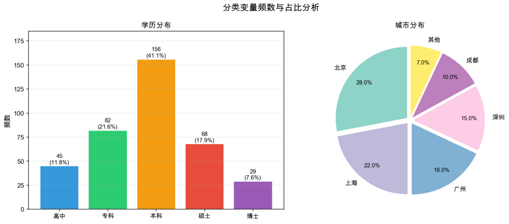

*图2.1：分类变量可视化：条形图（左）与饼图（右）。*

表2.3  分类变量频数分布表

| 学历（有序，$N=380$） | 频数 | 频率 | 累计频率 |
|---|---:|---:|---:|
| 高中 | 45 | 11.8% | 11.8% |
| 专科 | 82 | 21.6% | 33.4% |
| 本科 | 156 | 41.1% | 74.5% |
| 硕士 | 68 | 17.9% | 92.4% |
| 博士 | 29 | 7.6% | 100.0% |
| 合计 | 380 | 100.0% | — |

| 城市（无序，$N=100$） | 频数 | 频率 | 累计频率 |
|---|---:|---:|---:|
| 北京 | 28 | 28.0% | 28.0% |
| 上海 | 22 | 22.0% | 50.0% |
| 广州 | 18 | 18.0% | 68.0% |
| 深圳 | 15 | 15.0% | 83.0% |
| 成都 | 10 | 10.0% | 93.0% |
| 其他 | 7 | 7.0% | 100.0% |
| 合计 | 100 | 100.0% | — |

表2.4  频数与频率的报告规范

| 场景 | 推荐做法 | 常见错误 |
|---|---|---|
| 学术论文 | 同时列出频数和频率 | 只列频率不列频数，读者无法判断样本量 |
| 商业报告 | 以频率（%）为主，并附 $N$ | 小样本（$N<50$）仅报百分比，造成“精确”错觉 |
| 有序变量 | 增加累计频率列 | 对无序变量（如城市）也列累计频率 |
| 小样本 | 只列频数，避免百分比 | 4人中3人报75%，数字虽正确但可能造成严重误导 |

### 2.1.3 均值与中位数的关系：判断偏斜

均值与中位数的差距，是判断偏斜方向的快速方法。

> **性质  均值与中位数判断偏斜**
>
> - $\mu>Q_2$：右偏，少数极大值拉高均值；
> - $\mu<Q_2$：左偏，少数极小值拉低均值；
> - $\mu\approx Q_2$：近似对称，可能接近正态分布。

掌握偏斜方向后，还需要判断偏斜和尖峭的程度，这可通过偏度和峰度进行量化。

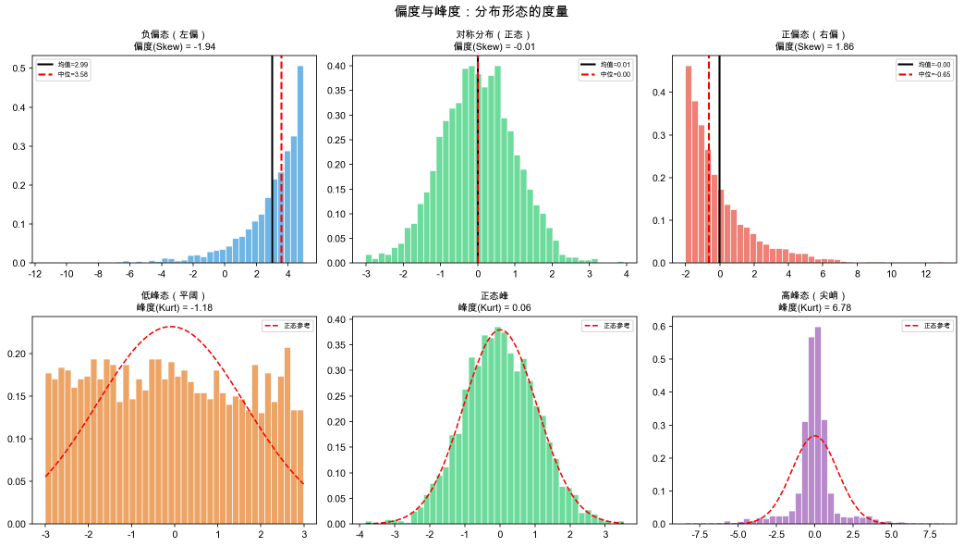

*图2.2：偏度与峰度：六种典型分布形态对比。*

### 2.1.4 偏度与峰度

> **定义2.2  偏度与峰度**
>
> 偏度描述尾部方向：大于0表示右偏，小于0表示左偏，接近0表示近似对称。峰度（Fisher）描述中心附近的集中程度：大于0表示尖峰（数据更集中），小于0表示平峰（数据更分散），等于0表示正态分布基准。

表2.5  偏度与峰度经验阈值

| 指标 | 阈值 | 判断与建议 |
|---|---|---|
| 偏度 | $|\mathrm{Skew}|<0.5$ | 近似对称，可接受正态假设 |
| 偏度 | $|\mathrm{Skew}|>1$ | 显著偏斜，建议考虑对数或 Box-Cox 变换 |
| 峰度 | $|\mathrm{Kurt}|<1$ | 近似正态峰，可接受正态假设 |
| 峰度 | $|\mathrm{Kurt}|>1$ | 偏离正态，结合 Q-Q 图（§2.3）进行视觉验证 |
| 峰度 | 极端尖峰 | 可能提示大量重复值或天花板效应；原始 OCR 中对应阈值疑似为“$\mathrm{Kurt}>3$”，需复核 |

> **笔记**  偏度和峰度依赖矩，与均值一样对极端值敏感。建议先依据第1章介绍的 IQR 方法识别并处理异常值，再计算偏度和峰度；否则，一个极端值就可能使偏度从0.3变为3.0。

## 2.2 描述性可视化方法

### 2.2.1 箱线图（Box Plot）

> **定义2.3  箱线图**
>
> 箱线图基于五数概括（Min、$Q_1$、Median、$Q_3$、Max）。箱体从 $Q_1$ 延伸到 $Q_3$，高度为 IQR；须线延伸至区间
>
> $$
> [Q_1-1.5\,\mathrm{IQR},\;Q_3+1.5\,\mathrm{IQR}]
> $$
>
> 内的最远点；须线外的点视为异常值。因此，箱线图本质上是第1章§1.4所述 IQR 异常值检测方法的可视化封装。

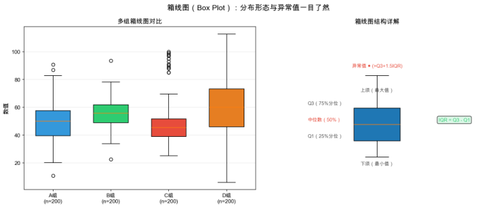

*图2.3：箱线图：多组对比（左）与结构详解（右）。*

表2.6  箱线图判读速查

| 观察点 | 解读 |
|---|---|
| 中位数位置 | 反映集中趋势，位置越高通常表示取值越大 |
| 箱体长度（IQR） | 中间50%的离散程度，箱体越长表示越分散 |
| 中位数在箱体中的偏移 | 中位数靠近 $Q_1$ 通常表示右偏，靠近 $Q_3$ 通常表示左偏 |
| 须线长度 | 反映尾部离散程度 |
| 异常点数量 | 反映极端值密度 |

> **注**  箱线图适合初筛，但无法展示多模态分布。两组箱线图可能相同，而实际分布一组单峰、另一组双峰；此时需要用小提琴图补充。

### 2.2.2 直方图（Histogram）

箱线图能展示“五数概括”，却不能直接展示分布的具体形状，例如单峰、双峰、均匀或扎堆。直方图可以弥补这一点。

> **定义2.4  直方图**
>
> 直方图将连续数据分箱（bin），柱高表示区间频数或密度。探索新数据时，通常应优先绘制直方图。分箱数可取
>
> $$
> \sqrt{n}=\sqrt{500}\approx22
> $$
>
> 个作为初始参考；最终分箱数仍需结合样本量和图形可读性调整。

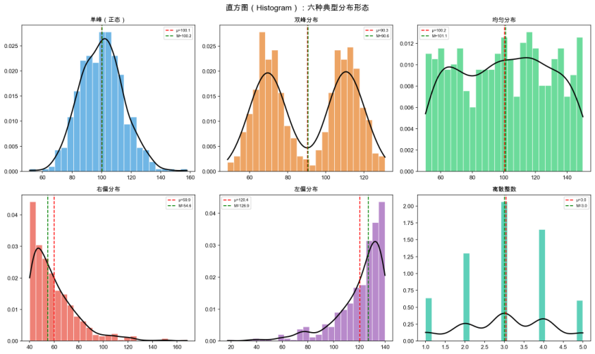

*图2.4：直方图：六种典型分布形态。*

表2.7  六种分布形态与数据推断

| 形态 | 典型场景 | 下游处理建议 |
|---|---|---|
| 单峰对称 | 身高、体重、测量误差 | 可直接考虑参数方法 |
| 双峰 | 两个子群体混合，如男女身高 | 按分组变量拆分后分别分析 |
| 右偏 | 收入、房价、响应时间 | 考虑对数或 Box-Cox 变换 |
| 左偏 | 满分附近的成绩、完成率 | 可考虑反射后取对数，或使用非参数方法 |
| 均匀 | 随机数、轮询调度 | 检查是否存在截断或人工干预 |
| 离散整数 | 1—5星评分、计数 | 使用条形图，避免用密度曲线过度平滑 |

### 2.2.3 密度分布图（Density Plot）

直方图对分箱宽度敏感，不同分箱数可能得到差异很大的视觉结果。密度图通过核密度估计（KDE）生成平滑曲线，可用于更细致地比较分布形状。

> **定义2.5  密度图与 KDE**
>
> KDE 的做法是为每个数据点放置一个小的高斯核，再将所有核叠加形成连续曲线。曲线下的总面积恒为1，因此不同样本量的数据在形状比较上更方便。

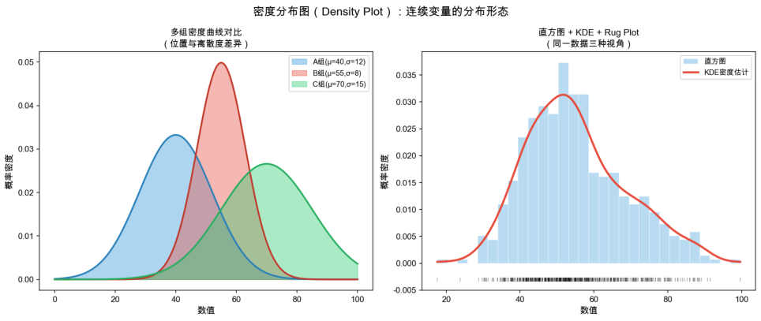

*图2.5：密度分布图：多组对比（左）与直方图、KDE、Rug Plot 组合（右）。*

表2.8  直方图与密度图选择指南

| 对比维度 | 直方图 | 密度图 |
|---|---|---|
| 核心优势 | 反映绝对频数，直观 | 平滑连续，不受固定分箱方式干扰 |
| 多组对比 | 叠加后容易遮挡，不推荐 | 可叠加多条曲线，便于比较 |
| 最佳场景 | 汇报“有多少人”等具体数量 | 精细比较分布形状和偏度差异 |

### 2.2.4 条形图与环形图

> **定义2.6  条形图（Bar Chart）与环形图（Donut Chart）**
>
> 条形图用矩形高度表示各分类的频数，适合精确比较类别之间的差异。环形图是饼图的变体，中间的镂空区域可以放置总量或关键指标，视觉上通常比饼图更简洁。
>
> 一般而言，当类别数不超过5且需要强调占比时，可以考虑环形图；其余情况优先使用条形图。具体类别数阈值属于经验规则，使用时应结合图面可读性判断。

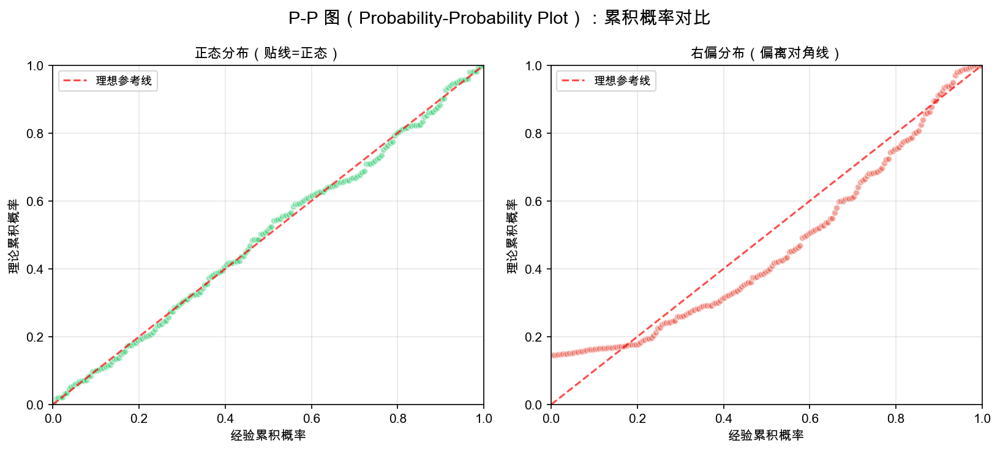

*图2.6：左侧水平条形图适合类别名较长的场景；中间环形图中心显示总计销量；右侧堆叠条形图同时展示产品的月度构成占比和总量趋势。*

> **注**  堆叠条形图适合展示“部分与整体”关系的时序变化。当堆叠层数过多时，中间层的比较会变得困难，此时可以考虑用折线图替代。

### 2.2.5 热力图（Heatmap）

> **定义2.7  热力图**
>
> 热力图用颜色深浅映射数值大小，将二维矩阵中的数值模式直观呈现出来。它常用于展示多变量分组数值分布、观测值的相对大小，以及缺失或异常值的空间模式。

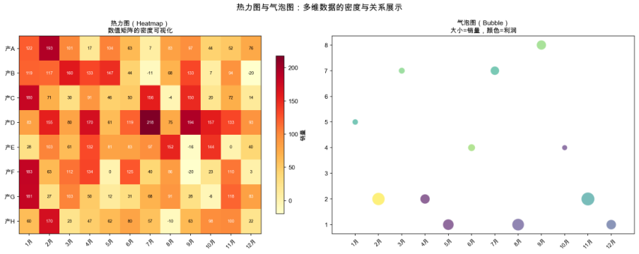

*图2.7：左侧热力图中，颜色深浅反映各产品在12个月中的销量密度，颜色越深表示销量越高；右侧气泡图用气泡大小表示销量、颜色表示利润，可同时展示月份、销量和利润三个维度。*

> **笔记**  热力图对配色方案高度敏感。建议使用从浅到深的单色渐变（如 YlOrRd、Blues），避免使用彩虹色方案；不恰当的配色可能使人眼无法准确分辨数值差异。

### 2.2.6 小提琴图与山脊图

> **定义2.8  小提琴图与山脊图**
>
> 小提琴图是箱线图的增强版，在箱线图的基础上叠加数据密度估计曲线，因此能同时展示四分位数和分布形态。山脊图将多组密度曲线纵向堆叠，适合比较多组数据的分布差异。当组数超过3时，山脊图通常比重叠的密度曲线更清晰。

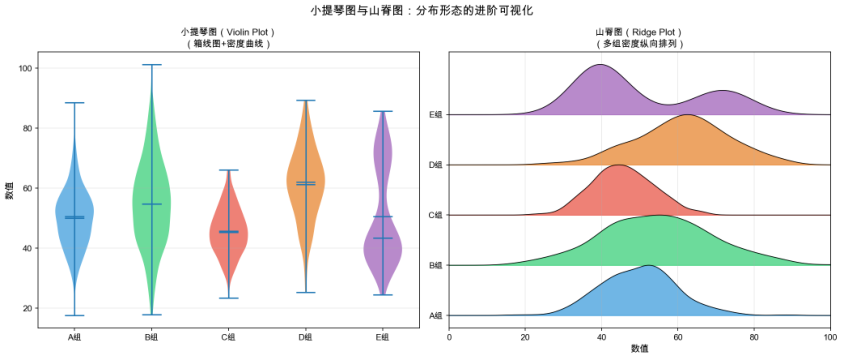

*图2.8：左侧小提琴图中，E组呈现明显的双峰形态；右侧山脊图展示了五组数据的密度差异，E组再次呈现双峰特征。*

> **注**  小提琴图与山脊图可组成探索性数据分析（EDA）的组合流程：先用山脊图快速扫视所有组的分布形状，发现可疑组后，再用小提琴图细看该组的四分位数和密度细节。这一流程在变量数超过10的初步探索中尤其高效。

### 2.2.7 可视化方法速览

描述性统计主要回答四个问题：集中趋势、离散程度、分布形态和类别分布。

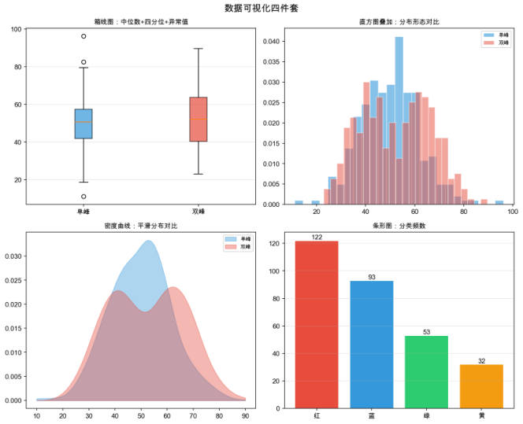

*图2.9：描述性统计的四类核心可视化信息。*

表2.9  描述性统计可视化选图速查

| 分析目标 | 首选图 | 进阶或替代图 | 适用数据类型 |
|---|---|---|---|
| 集中趋势、离散程度与异常值 | 箱线图 | 小提琴图 | 连续变量 |
| 分布形状（单峰、双峰、偏斜） | 直方图 | 密度图 | 连续变量 |
| 多组分布精细对比 | 密度图 | 山脊图 | 连续变量 |
| 类别占比与频数 | 条形图 | 环形图 | 分类变量 |
| 二维数值密度 | 热力图 | 气泡图 | 矩阵或交叉表 |
| 构成与总量趋势 | 堆叠条形图 | 面积图 | 分类时间数据 |

## 2.3 数据正态性检验

> **定义2.9  正态性检验**
>
> 正态性检验用于判断一组数据是否来自正态分布总体，对后续分析方法的选择具有重要影响。
>
> - 参数检验，如 $t$ 检验、方差分析和 Pearson 相关，通常以正态性假设为基础；若数据明显非正态，检验结论可能不可靠。
> - 线性回归的最小二乘估计在误差正态时具有更好的推断性质；非正态时，点估计仍可能具有一致性，但置信区间和 $p$ 值可能失真。
> - PCA 降维及许多机器学习算法本身不要求数据服从正态分布，但正态化变换有时能够改善模型表现。

> **笔记**  当样本量较大（原稿给出的经验值为 $n>300$，该阈值需结合具体检验和应用场景复核）时，中心极限定理会使许多方法对正态性的要求得到放松。正态性结论应结合样本量、图形、业务理解和模型目标判断，而不应机械套用。

### 2.3.1 Q-Q图（分位数—分位数图）

> **定义2.10  Q-Q图（Quantile-Quantile Plot）**
>
> Q-Q图将样本分位数与理论正态分布分位数进行对比。如果数据近似服从正态分布，散点应大致落在参考直线上。偏离直线的形状可以提示具体的非正态类型。

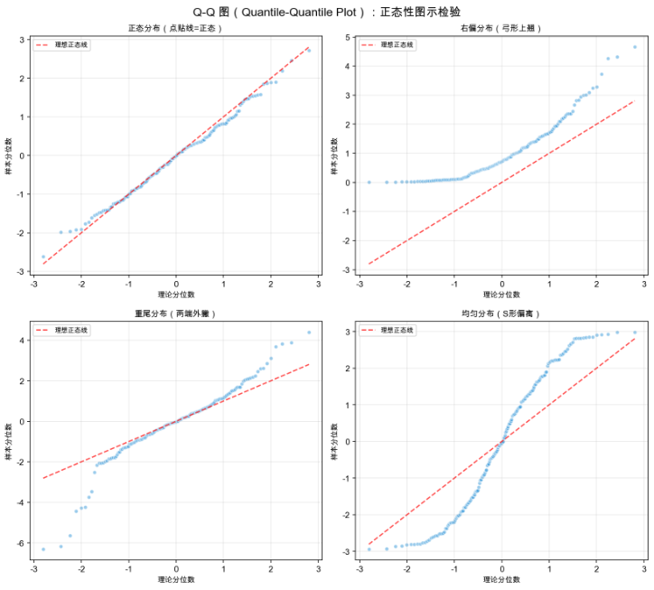

*图2.10：四种典型的Q-Q图形状。左上为近似正态数据；右上为右偏数据；左下为重尾分布；右下为均匀分布。*

> **性质  Q-Q图的判读方法**
>
> - 散点大致贴线：近似正态；
> - 弓形上翘：右偏（正偏）；
> - 弓形下垂：左偏（负偏）；
> - 两端向外撇：重尾，比正态分布更容易出现极端值；
> - S形：轻尾，例如均匀分布，极端值比正态分布更少。

### 2.3.2 P-P图（概率—概率图）

> **定义2.11  P-P图（Probability-Probability Plot）**
>
> P-P图将样本的经验累积概率与理论正态累积概率进行对比。与Q-Q图相比，P-P图更擅长发现中心区域的偏差，而Q-Q图更擅长发现尾部偏差。两者结合使用，可获得更全面的正态性评估。

### 2.3.3 Shapiro—Wilk正态性检验

> **定义2.12  Shapiro—Wilk检验**
>
> Shapiro—Wilk检验通过统计量 $W$ 判断样本是否来自正态分布。当 $p$ 值较小时，拒绝正态性假设。实际分析中，应结合样本量、Q-Q图和业务背景进行判断。

## 2.4 特征工程

经过描述性统计分析和可视化探索，我们已经了解了数据的基本特征和分布规律。在此基础上，特征工程（Feature Engineering）是连接“数据探索”与“模型建立”的关键桥梁，它决定了模型输入的质量上限。

特征工程包含三个核心子任务：

1. **特征选择**：从已有特征中筛选最有用的变量；
2. **特征降维**：将高维特征压缩到低维空间；
3. **特征构造**：基于已有特征衍生出新特征。

三者目的不同但相辅相成：可以先构造丰富特征，再筛选、去除冗余，必要时降维去噪。

### 2.4.1 特征选择：筛选真正有用的变量

特征选择要回答的问题是：在数十甚至上百个特征中，哪些特征真正对预测目标有贡献？多余的噪声特征不仅会增加计算量，还可能引入多重共线性和过拟合等隐患。

特征选择通常分为过滤法、包裹法和嵌入法。过滤法在建模之前，通过统计检验独立评估每个特征与目标变量的关联强度，再按得分排序并设定阈值；它计算高效且与后续模型无关，但无法充分考虑特征之间的交互效应。包裹法和嵌入法在原稿中仅作为分类框架列出，具体算法与示例需结合原始教材页面进一步复核。

**方差过滤——低信息特征筛除。** 如果某个特征在所有样本上的取值几乎一致，方差接近零，则它通常难以区分不同样本。可设定方差阈值，将低于阈值的特征淘汰。

**相关系数过滤——线性关系快速筛选。** 计算特征与目标变量的 Pearson 相关系数。$|r|$ 接近1表示强线性相关，接近0表示线性关联较弱。但相关系数只能检测线性关系；若特征与目标呈U形关系，$r$ 可能接近0，而特征本身仍然有用。

*图2.11：P-P 图：正态分布（左）与右偏分布（右）的累积概率对比*

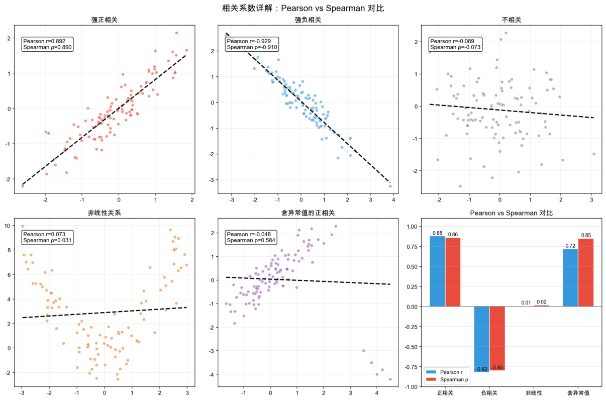

*图2.12：特征与目标变量的相关散点图矩阵。左下角子图呈现明显线性趋势，右上角子图较为散乱。*

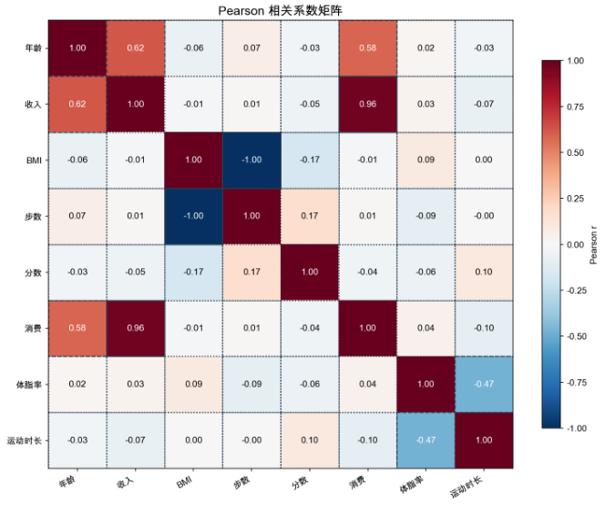

*图2.13：特征相关性热力图。深红色块表示高度正相关（$r>0.8$），深蓝色块表示高度负相关（$r<-0.8$），白色块表示相关性较弱。图示阈值与具体数据需复核。*

**卡方检验——分类变量的关联性检验。** 当特征和目标变量均为类别型时，卡方检验是过滤法的重要工具。若特征与目标相互独立，观察频数应接近期望频数；偏差越大，卡方值越大，关联越显著。其统计量为

$$
\chi^2=\sum_{i,j}\frac{(O_{ij}-E_{ij})^2}{E_{ij}}。
$$

其中，$O_{ij}$ 为实际频数，$E_{ij}$ 为独立性假设下的期望频数。

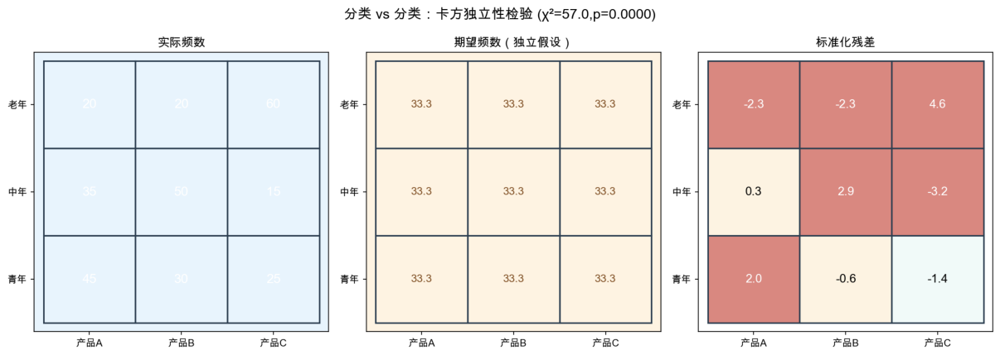

*图2.14：卡方检验筛选分类特征。条形高度表示卡方值，红色虚线表示显著性阈值；具体阈值需结合检验设定复核。*

**方差分析（ANOVA）——数值特征对分类目标的区分力。** 当特征为数值型、目标为类别型时，ANOVA检验不同类别下的特征均值是否存在显著差异。F值越大，说明该特征对不同类别的区分能力越强。

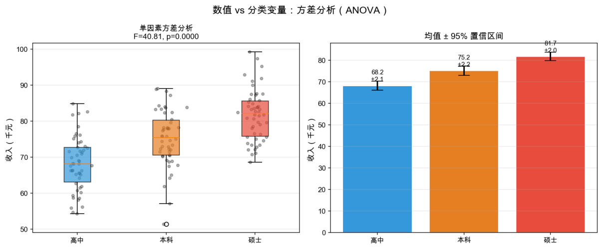

*图2.15：ANOVA F检验筛选连续特征。F值越高，表示特征的类别区分力越强。*

### 2.4.2 特征降维：从高维到低维的压缩

当特征数量 $p$ 接近甚至超过样本数 $n$ 时（$p>n$ 常被视为维数灾难的典型情形），直接建模容易出现严重过拟合。特征降维通过数学变换将原始高维特征映射到低维空间，在尽量保留原始信息的前提下压缩维度。

主成分分析（PCA）是应用广泛的线性降维方法。它首先寻找数据方差最大的方向作为第一主成分，再在该方向的正交补空间中寻找次大方差方向，依次得到后续主成分。每个主成分是原始特征的线性组合，彼此正交；前 $k$ 个主成分的累计方差贡献率用于衡量降维后保留的信息量。

设中心化后的数据矩阵为 $X$，样本数为 $n$，则协方差矩阵可写为

$$
\Sigma=\frac{1}{n-1}X^{\mathsf T}X。
$$

对协方差矩阵进行特征值分解：

$$
\Sigma v_i=\lambda_i v_i。
$$

其中，$\lambda_i$ 为按大小排列的第 $i$ 个特征值，$v_i$ 为对应的特征向量，即第 $i$ 个主成分的方向。第 $i$ 个主成分的方差贡献率为

$$
\frac{\lambda_i}{\sum_j\lambda_j}。
$$

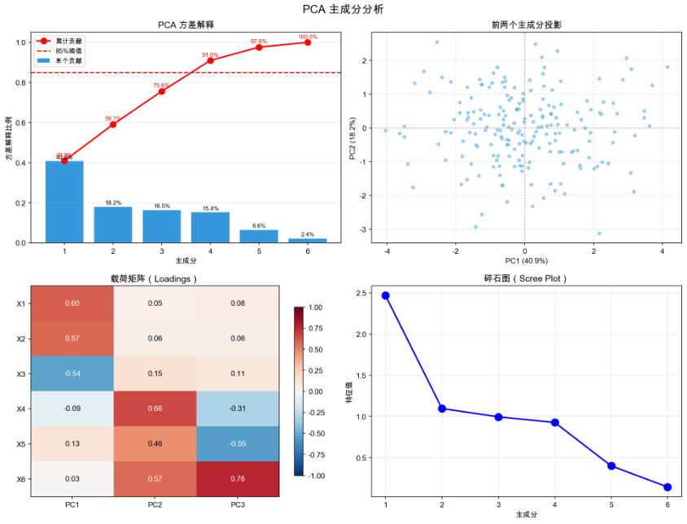

*图2.16：PCA降维可视化。左图为原始高维数据在前两个主成分方向上的投影，右图为各主成分的方差贡献率柱状图与累计曲线。*

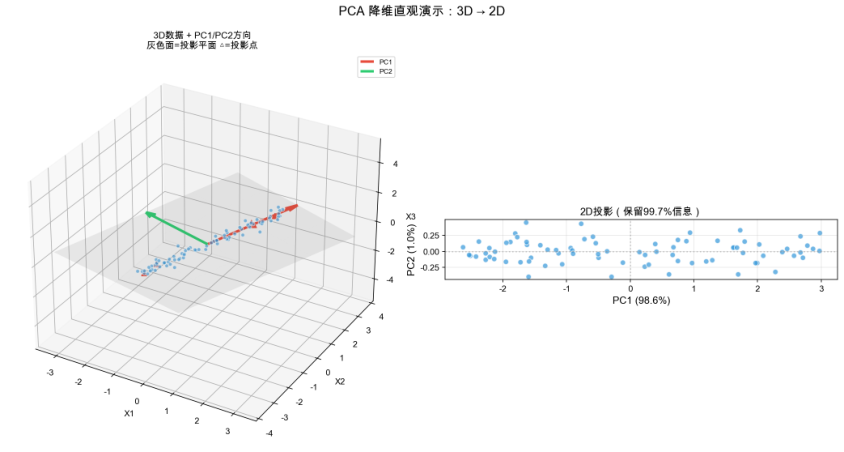

*图2.17：降维效果对比：原始高维数据（左）、PCA降维至2维（中）和 t-SNE 非线性降维（右）。*

PCA的使用要领如下：

1. 降维前必须先做标准化。PCA对尺度敏感，量纲不同会导致大方差特征主导主成分；
2. 通常可依据累计方差贡献率确定保留的主成分数，原稿给出的参考区间为85%—95%，具体比例需结合任务复核；
3. 主成分会损失原始特征的直接可解释性。每个主成分是全部原始特征的线性组合，不能简单地说“这个主成分代表年龄”。

### 2.4.3 特征构造：从现有特征中衍生新信息

特征构造（Feature Construction）是特征工程中最具创造性的环节。它基于领域知识和数据理解，从现有特征中构造表达力更强的新特征。

**分箱（Binning）。** 分箱将连续变量按取值区间切分为若干“箱”，形成离散类别，适用于以下场景：

1. 变量与目标的关系高度非线性，分箱后可以使用简单的计数或均值进行建模；
2. 变量存在极端值，分箱具有一定的缩尾效果，极端值被归入首尾箱；
3. 业务上需要可解释的分段逻辑。

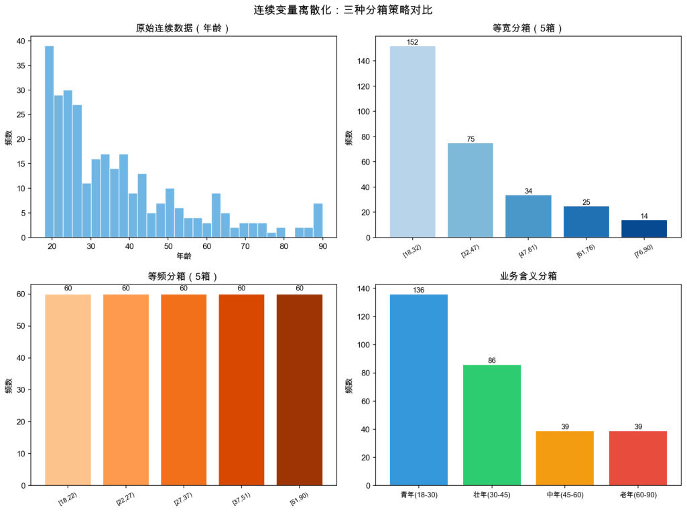

*图2.18：等宽分箱（左）、等频分箱（中）和基于决策树的最优分箱（右）。最优分箱的分割点可以最大化箱间目标差异。*

**样本不均衡处理。** 在分类问题中，如果正负样本比例严重失衡，例如欺诈检测中欺诈比例不足1%，模型可能倾向于把所有样本预测为多数类，导致准确率看似很高但没有实际意义。特征工程层面的应对手段包括欠采样、过采样以及两者的混合策略。

SMOTE（Synthetic Minority Oversampling Technique，合成少数类过采样技术）是经典的过采样算法。对于每个少数类样本，找到其 $k$ 个同类近邻，再沿两点连线方向进行随机插值以生成新样本。相比简单复制，这种方法通常更有助于提升模型的泛化能力，但采样比例和 $k$ 值需结合数据分布复核。

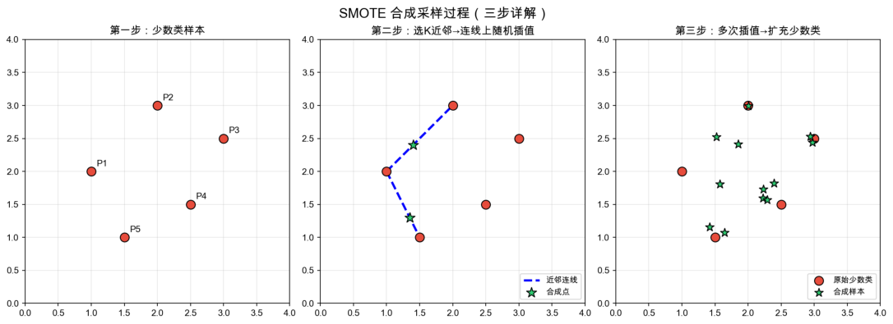

*图2.19：SMOTE过采样过程。橙色点为原始少数类样本，蓝色点为通过线性插值合成的样本。*

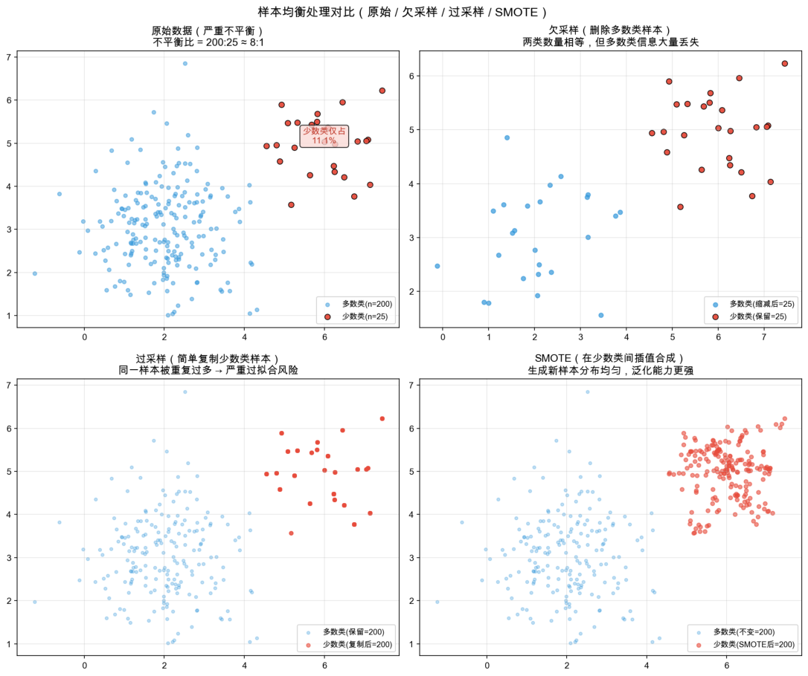

*图2.20：不均衡数据处理策略对比：原始分布（左）、欠采样（中，多数类减少）和过采样（右，少数类增加）。*

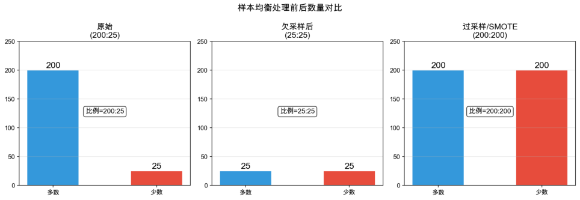

*图2.21：不同采样比例下的正负样本数量变化。原稿建议的折中目标比例为1:1至1:3，具体比例需结合任务复核。*

### 2.4.4 多重共线性诊断

多重共线性（Multicollinearity）是指两个或多个特征之间存在高度线性相关关系。当共线性严重时，最小二乘估计的系数方差会急剧膨胀，进而影响系数解释和统计推断。

方差膨胀因子（VIF）用于衡量共线性导致的方差膨胀：

$$
\mathrm{VIF}_j=\frac{1}{1-R_j^2}。
$$

其中，$R_j^2$ 是用其余特征预测第 $j$ 个特征时得到的决定系数。通常，$\mathrm{VIF}>10$ 被视为严重共线性的提示，但具体阈值应结合样本量、模型用途和领域经验判断。

常见解决策略包括：

1. 删除VIF最高的特征；
2. 使用PCA合并相关特征；
3. 使用对共线性相对不敏感的模型，例如采用 $L_2$ 正则化的 Ridge 回归或基于树的模型。

## 2.5 本章总结

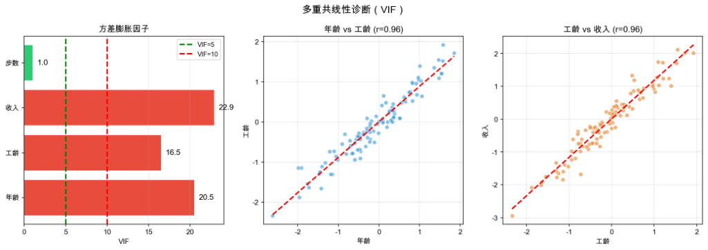

*图2.22：多重共线性诊断矩阵。上三角为两两相关系数，对角线为VIF值；颜色越深表示相关性越强。*

特征工程是数据预处理与模型建立之间的关键纽带。一份完整的特征工程工作报告应包含：

1. 原始特征清单与基本统计；
2. 特征选择方法与筛选结果，并说明保留或剔除理由；
3. 若执行了降维，报告累计方差贡献率与主成分解释；
4. 若构造了新特征，说明构造逻辑与预期效果。

在数学建模竞赛中，特征工程的细致程度往往是区分优秀论文与普通论文的关键。评委会会通过特征处理过程判断参赛者对数据的理解深度以及模型结论的可靠性。

### 练习2.1

某电商平台用户数据中，“年消费额”的均值为8,500元，中位数为5,200元，标准差为6,800元。请判断该变量的分布形态（左偏、右偏或对称），并说明理由。若需要向管理层汇报用户的典型消费水平，应使用均值还是中位数？为什么？

### 练习2.2

某数据集包含200名学生的考试成绩，已知均值为75分，标准差为12分，中位数为78分。

1. 判断成绩分布的偏斜方向并说明依据；
2. 若某学生得分为95分，其 Z-Score 是多少；
3. 若成绩近似服从正态分布，大约有多少比例的学生分数位于63分到87分之间？

### 练习2.3

简述直方图与密度图的异同点及各自的适用场景。什么情况下会选择密度图而非直方图？

### 练习2.4

什么是Q-Q图？如何通过Q-Q图判断数据是否服从正态分布？请至少描述三种典型的偏离形态及其含义。

### 练习2.5

特征选择的三大类方法（过滤法、包裹法、嵌入法）各有什么特点？分别适用于什么场景？

### 练习2.6

什么是多重共线性？它会对线性回归模型造成什么影响？如何诊断和处理？

### 练习2.7  综合应用题

某医院收集了1,000名患者的体检数据，包含年龄、身高、体重、血压、血糖、胆固醇等15个连续变量，目标是预测患者是否患有糖尿病。请设计完整的数据探索与特征工程流程，包括：

1. 描述性统计分析应关注哪些指标？
2. 需要绘制哪些图形来探索数据特征？
3. 如何进行特征选择？可能用到哪些方法？
4. 如果发现变量间存在严重共线性，应如何处理？

## 结论回顾

本章的数据探索与特征工程可以概括为四个核心模块：

1. **描述性统计**：集中趋势包括均值、中位数和众数；离散程度包括标准差、IQR和极差；分布形态包括偏度和峰度。阅读统计表时，先看样本量，再看极值，最后看均值和标准差。
2. **可视化方法**：箱线图观察异常值与分位数，直方图观察分布形状，密度图进行多组精细对比，条形图展示分类频数，热力图呈现二维数值模式。应根据分析目标选择图表，而不是为了美观而绘图。
3. **正态性检验**：Q-Q图重点观察尾部偏差，P-P图重点观察中心偏差，Shapiro—Wilk检验提供定量证据。大样本下可以适当放松正态性要求，但检验结果仍需结合业务理解。
4. **特征工程**：特征筛选包括过滤法、包裹法和嵌入法；特征降维以PCA为代表；特征构造包括分箱和交互项等；共线性可通过VIF诊断。特征工程的质量往往决定模型的输入上限。

数据探索不是“跑完描述性统计就结束”，而是通过统计量与图形的交叉验证，形成对数据的完整认知，为后续建模决策提供依据。
