# 第5章 预测模型

## 内容提要

- 5.1 多元线性回归（MLR）
- 5.2 指数平滑法（ETS）
- 5.3 ARIMA 模型
- 5.4 灰色预测 GM(1,1)
- 5.5 LSTM 神经网络
- 5.6 算法对比与选择决策
- 5.7 本章总结

预测是数学建模竞赛中最常见的任务类型之一。从预测未来经济走势、预估人口增长、推断污染物浓度变化，到预测股票价格、电力负荷、交通流量——预测问题覆盖了国赛 A/B/C 三题的各个角落。

预测与其他建模任务有一个根本区别：预测是对未来的推断，而未来是未知的。因此预测模型的评估必须格外严谨——你不能用“模型在训练数据上拟合得很好”来证明预测能力，因为过拟合的模型在训练集上拟合得最好。真正有效的预测模型必须在未参与训练的数据上验证其泛化能力。

## 5.1 多元线性回归（MLR）

### 5.1.1 直观理解

多元线性回归（Multiple Linear Regression）是预测模型的“地基”。它的思路朴素但有效：假设目标变量 $y$ 与多个特征 $X_1,X_2,\ldots,X_p$ 之间存在线性关系，用最小二乘法找到最佳拟合超平面。

> 【可信度：示意例题】以下数据与结论用于演示建模流程，不代表真实房价规律。
>
> **【例题5.1】MLR：房价与面积**
>
> 某城市记录了 5 套住宅的面积（$X$，单位：m²）与售价（$Y$，单位：万元）如下：
>
> **表5.1：5套住宅数据**
>
> | 编号 | 面积 $X$ | 价格 $Y$ |
> |:---:|---:|---:|
> | 1 | 70 | 102 |
> | 2 | 90 | 118 |
> | 3 | 110 | 140 |
> | 4 | 130 | 165 |
> | 5 | 150 | 189 |
>
> 目标：用这 5 组数据建立回归方程 $\hat{Y}=\hat{\beta}_0+\hat{\beta}_1X$（一元线性回归是 MLR 在 $p=1$ 时的特例），并预测 $X=120$ 时的房价。
>
> 下面我们按四个 Step，一步步完成 MLR 的完整建模流程。

### 5.1.2 Step 1：数据可视化——散点图初探

任何预测的第一步都是先看数据长什么样。把 5 个点画在坐标系上，直觉上判断是否存在线性趋势。

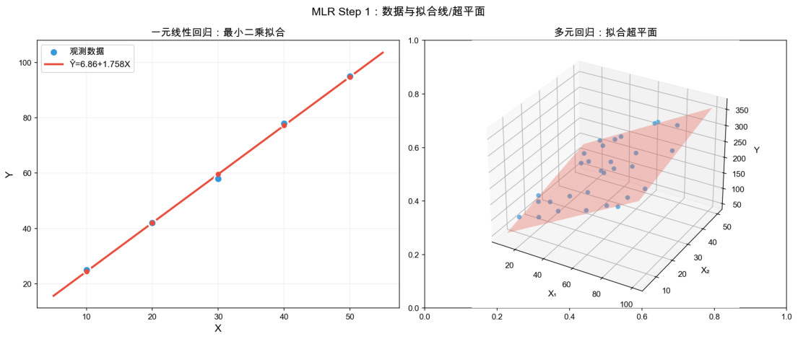

*图5.1：MLR Step 1：原始数据散点图。*

图 5.1 显示 5 个点近似分布在一条直线上，说明用线性回归是合理的。如果点明显构成曲线（如抛物线形状），则需要考虑多项式回归或其他非线性模型。

先算两个均值作为后续计算的“锚点”：

$$
\bar{X}=\frac{70+90+110+130+150}{5}=110,
$$

$$
\bar{Y}=\frac{102+118+140+165+189}{5}=142.8.
$$

### 5.1.3 Step 2：最小二乘法——求解回归系数

最小二乘法的目标：找一条直线 $\hat{Y}=\hat{\beta}_0+\hat{\beta}_1X$，使得残差平方和 $\sum(y_i-\hat{y}_i)^2$ 最小。

> 【可信度：公式定义】以下公式是最小二乘估计的标准定义。
>
> **【定义5.1】最小二乘估计**
>
> 对于一元线性回归，最小二乘解有闭式公式：
>
> $$
> \hat{\beta}_1=\frac{\sum_{i=1}^{n}(x_i-\bar{x})(y_i-\bar{y})}{\sum_{i=1}^{n}(x_i-\bar{x})^2},\qquad
> \hat{\beta}_0=\bar{Y}-\hat{\beta}_1\bar{X}.
> $$

过程：分子分母逐项累加。

**表5.2：最小二乘法计算表**

| $i$ | $x_i$ | $y_i$ | $x_i-\bar{x}$ | $y_i-\bar{y}$ | $(x_i-\bar{x})(y_i-\bar{y})$ |
|:---:|---:|---:|---:|---:|---:|
| 1 | 70 | 102 | −40 | −40.8 | 1632 |
| 2 | 90 | 118 | −20 | −24.8 | 496 |
| 3 | 110 | 140 | 0 | −2.8 | 0 |
| 4 | 130 | 165 | 20 | 22.2 | 444 |
| 5 | 150 | 189 | 40 | 46.2 | 1848 |
| 求和 | — | — | 0 | 0 | 4420 |

分母：

$$
\sum(x_i-\bar{x})^2=(-40)^2+(-20)^2+0^2+20^2+40^2=1600+400+0+400+1600=4000.
$$

$$
\hat{\beta}_1=\frac{4420}{4000}=1.105,
\qquad
\hat{\beta}_0=142.8-1.105\times110=21.25.
$$

回归方程：

$$
\hat{Y}=21.25+1.105X.
$$

含义：面积每增加 1 m²，房价平均上涨约 1.105 万元。

### 5.1.4 Step 3：系数检验与模型评价

求出系数后，需要回答两个问题：（1）这个系数“靠谱”吗？（2）模型整体拟合效果如何？

#### $R^2$（决定系数）

先算各点的预测值 $\hat{y}_i$ 和残差 $e_i$：

**表5.3：拟合值与残差计算**

| $i$ | $x_i$ | $y_i$ | $\hat{y}_i$ | $e_i=y_i-\hat{y}_i$ | $(y_i-\bar{y})^2$ | $e_i^2$ |
|:---:|---:|---:|---:|---:|---:|---:|
| 1 | 70 | 102 | 98.60 | 3.40 | 1664.64 | 11.56 |
| 2 | 90 | 118 | 120.70 | −2.70 | 615.04 | 7.29 |
| 3 | 110 | 140 | 142.80 | −2.80 | 7.84 | 7.84 |
| 4 | 130 | 165 | 164.90 | 0.10 | 492.84 | 0.01 |
| 5 | 150 | 189 | 187.00 | 2.00 | 2134.44 | 4.00 |
| 求和 | — | — | — | 0 | 4914.80 | 30.70 |

$$
R^2=1-\frac{\sum e_i^2}{\sum(y_i-\bar{y})^2}=1-\frac{30.70}{4914.80}=1-0.00625=0.9938.
$$

$R^2=0.9938$ 意味着面积这一个变量解释了房价变动的 99.38%——拟合非常出色。

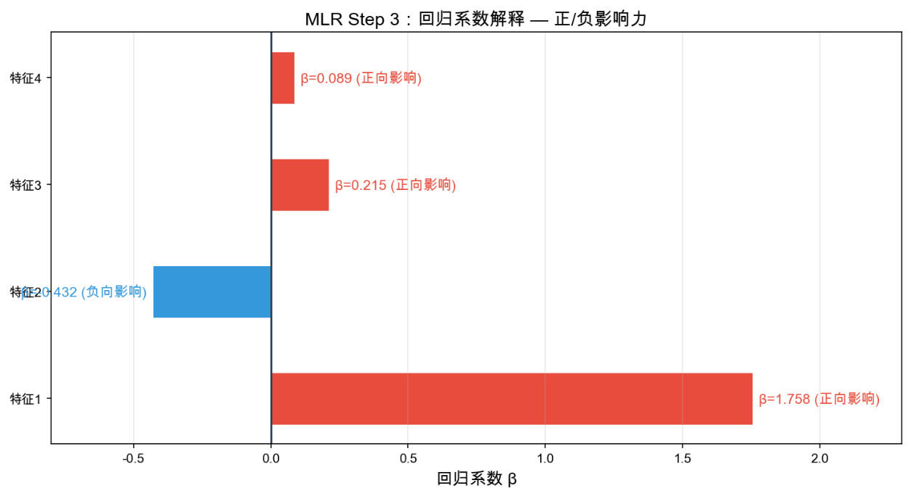

*图5.2：MLR Step 3：回归系数与模型评价。*

图 5.2 直观展示了回归系数 $\hat{\beta}_1=1.105$ 的含义——斜率即“边际效应”，并标注了 $R^2$ 和截距值。

**多元推广：**当有 $p$ 个自变量时，最小二乘解推广为矩阵形式：

$$
\hat{\beta}=(X^TX)^{-1}X^Ty.
$$

其中 $X$ 是 $n\times(p+1)$ 的设计矩阵（第一列为全 1），$y$ 是 $n\times1$ 的目标向量。这个公式无论 $p$ 多大都适用——只要 $X^TX$ 可逆。

### 5.1.5 Step 4：预测——代入新数据

模型建好后，预测只需代入自变量：

$$
\hat{Y}_{\text{新}}=21.25+1.105\times120=21.25+132.60=153.85.
$$

预测结论：面积 120 m² 的住宅，预测售价约为 153.85 万元。

从预测结果来看，残差应随机散布在零线两侧——若发现“喇叭形”（异方差）或 U 形（非线性），说明模型假设可能不成立，需做变换或换模型。

> 【可信度：通用原理】该定理依赖所列误差假设，使用前需检查假设是否合理。
>
> **【定理5.1】高斯-马尔可夫定理**
>
> 在误差满足“零均值、同方差、不相关”的假设下，最小二乘估计 $\hat{\beta}$ 是最佳线性无偏估计（BLUE）——在所有线性无偏估计量中方差最小。

### 5.1.6 算法边界与选择决策

> **【性质】MLR 适用决策**
>
> 推荐使用：关系近似线性、需要系数解释（每个系数有明确经济含义）、多重共线性已处理（VIF < 10）。
>
> 谨慎使用：存在强非线性关系、自变量高度相关（需做 VIF 诊断，去掉冗余变量或用岭回归/Lasso）。
>
> 不宜使用：残差有明显模式（自相关→用 ARIMA 类）、样本量远小于特征数（$n<p$→用 Lasso 或 PLS）。
>
> 国赛用途：趋势基础预测、多因素影响分析、作为更复杂模型的 Baseline 对比。

## 5.2 指数平滑法（ETS）

### 5.2.1 直观理解

指数平滑法（Exponential Smoothing）是专为时间序列短期预测设计的方法。其思路源于一个朴素的直觉：预测明天时，今天的数据比一年前更重要。因此它对历史数据做加权平均，权重以指数速度衰减——最近一期权重最大，越远越小。

如果序列有趋势，可以升级为 Holt 双指数平滑（同时平滑水平和趋势）；如果还有季节性，再升级为 Holt-Winters 三指数平滑（水平 + 趋势 + 季节）。本章从最基础的一次指数平滑讲起。

### 5.2.2 一个例子入门

> 【可信度：示意例题】以下销售额、平滑系数和预测结果用于演示递推过程。
>
> **【例题5.2】一次指数平滑：周销量预测**
>
> 某便利店记录了连续 8 周的销售额（单位：万元）：

> **表5.4：8周销售额数据**
>
> | 周次 $t$ | 1 | 2 | 3 | 4 | 5 | 6 | 7 | 8 |
> |:---:|---:|---:|---:|---:|---:|---:|---:|---:|
> | 销售额 $y_t$ | 42 | 44 | 46 | 43 | 48 | 50 | 47 | 52 |
>
> 目标：取平滑系数 $\alpha=0.3$，用一次指数平滑预测第 9 周的销售额。
>
> 下面按三个 Step 完成 ETS 建模。

### 5.2.3 Step 1：初始化和递推——理解指数衰减权重的本质

> 【可信度：公式定义】以下递推式是一次指数平滑的标准定义。
>
> **【定义5.2】一次指数平滑**
>
> 设观测序列为 $y_1,y_2,\ldots,y_T$，一次指数平滑的递推公式为：
>
> $$
> S_t=\alpha y_t+(1-\alpha)S_{t-1},
> $$
> $$
> S_1=y_1.
> $$
>
> 预测值 $\hat{y}_{T+1}=S_T$。平滑系数 $\alpha\in(0,1)$ 控制新旧信息的权重比。

递推（$\alpha=0.3$）：

$$
\begin{aligned}
S_1&=y_1=42,\\
S_2&=0.3\times44+0.7\times42=42.60,\\
S_3&=0.3\times46+0.7\times42.60=43.62,\\
S_4&=0.3\times43+0.7\times43.62=43.43,\\
S_5&=0.3\times48+0.7\times43.43=44.80,\\
S_6&=0.3\times50+0.7\times44.80=46.36,\\
S_7&=0.3\times47+0.7\times46.36=46.55,\\
S_8&=0.3\times52+0.7\times46.55=48.19.
\end{aligned}
$$

第 9 周预测值：$\hat{y}_9=S_8=48.19$ 万元。

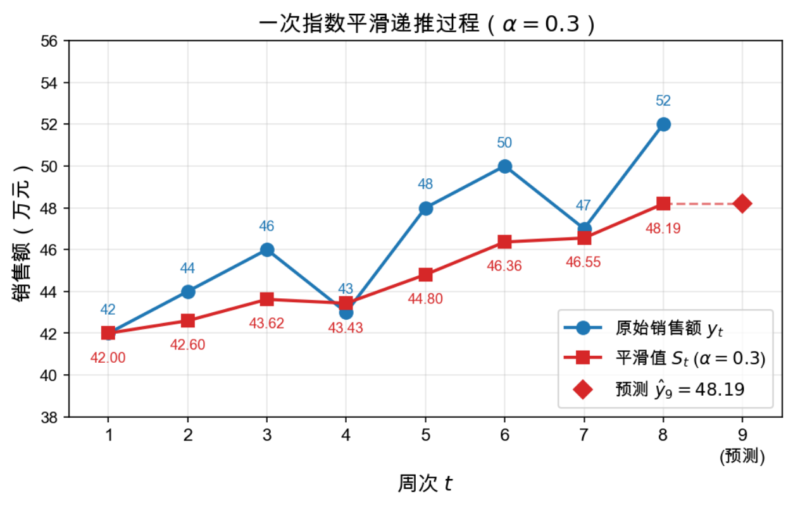

*图5.3：ETS Step 1：一次指数平滑的递推过程。*

图 5.3 展示了原始序列（蓝色）和平滑序列（红色）。平滑线抹平了原始序列的部分波动——第 4 周（43）和第 7 周（47）的低谷被相邻的高值“拉回”了一部分，这正是加权平均的效果。

### 5.2.4 Step 2：平滑系数 $\alpha$——预测的“灵敏度旋钮”

$\alpha$ 是 ETS 唯一的超参数，直接影响预测行为：

- $\alpha\to1$：几乎只“抄”最近一期数据，跟随性强但易被噪声误导。
- $\alpha\to0$：接近等权平均，极为平滑但对趋势反应迟缓。

典型取值：平稳序列 $\alpha=0.1\sim0.3$，波动剧烈序列 $\alpha=0.5\sim0.7$。

对比实验：同一组数据分别用 $\alpha=0.1、\alpha=0.3、\alpha=0.7$ 做平滑，观察差异。

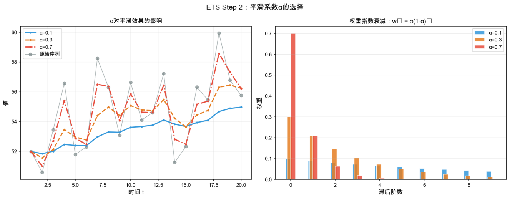

*图5.4：ETS Step 2：不同 $\alpha$ 的平滑效果对比。*

图 5.4 清晰展示了三种 $\alpha$ 的差异：$\alpha=0.7$（红色）紧贴原始数据的短期波动，响应最快；$\alpha=0.1$（蓝色）则呈现大幅度平滑，对第 4 周的下跌几乎无动于衷。右侧柱状图展示了各滞后阶数上权重的衰减速度——$\alpha$ 越大，权重越集中在最近一期。

如何选择 $\alpha$：实践中通过网格搜索（如 $\alpha=0.05,0.10,\ldots,0.95$），选择使预测误差（如 RMSE）最小的 $\alpha$ 值，类似交叉验证的思路。

### 5.2.5 Step 3：升级——Holt 双指数平滑（处理趋势）

当序列存在持续上升或下降趋势时，一次指数平滑的预测会“滞后”——永远追不上趋势。Holt 方法增加了一个趋势分量 $b_t$，用另一个平滑系数 $\beta$ 控制趋势的更新。

> 【可信度：公式定义】以下方程组是 Holt 双指数平滑的标准递推定义。
>
> **【定义5.3】Holt 双指数平滑**
>
> 水平方程和趋势方程同时递推：
>
> $$
> S_t=\alpha y_t+(1-\alpha)(S_{t-1}+b_{t-1})\qquad\text{（水平）}
> $$
>
> $$
> b_t=\beta(S_t-S_{t-1})+(1-\beta)b_{t-1}\qquad\text{（趋势）}
> $$
>
> $k$ 步预测：
>
> $$
> \hat{y}_{T+k}=S_T+k\cdot b_T\qquad\text{（水平+步长×趋势）}.
> $$

数值示例：在前述销售额数据上（隐含微弱上升趋势），取 $\alpha=0.3,\beta=0.2$：

$$
S_1=42,\quad b_1=0.
$$

$$
S_2=0.3\times44+0.7\times(42+0)=42.60,\quad b_2=0.2\times0.60+0.8\times0=0.12.
$$

$$
S_3=0.3\times46+0.7\times(42.60+0.12)=43.70,\quad b_3=0.2\times1.10+0.8\times0.12=0.32.
$$

从 $S_3,b_3$ 到 $S_8,b_8$ 仍按上述两条递推式逐期计算：

$$
S_t=0.3y_t+0.7(S_{t-1}+b_{t-1}),\qquad b_t=0.2(S_t-S_{t-1})+0.8b_{t-1},\quad t=4,\ldots,8.
$$

中间步骤不展开，按递推式计算得到：$S_8\approx49.36,\,b_8\approx0.94$。第 9 周预测为

$$
\hat{y}_9=S_8+1\times b_8\approx49.36+0.94=50.30
$$

（含趋势修正；该结果为示意计算，正式使用时应由代码复核）。

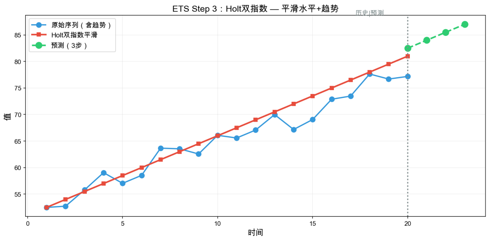

*图5.5：ETS Step 3：Holt 双指数平滑（含趋势分量）。*

图 5.5 对比了一次平滑（蓝色）和 Holt 方法（橙色虚线）。Holt 方法通过累加趋势分量，使得预测值不再滞后于上升趋势，对有明显趋势的序列效果显著更好。

进一步扩展：如果序列还有季节性（如每 12 个月一个周期），则升级为 Holt-Winters 三指数平滑——增加第三个方程平滑季节分量，此处不再展开。

### 5.2.6 算法边界与选择决策

> **【性质】ETS 适用决策**
>
> 推荐使用：短期预测（1—2 步）、无明显趋势和季节性、平稳序列；有趋势时升级为 Holt，有季节时升级为 Holt-Winters。
>
> 谨慎使用：存在结构性突变（如政策干预）、需要长期多步预测。
>
> 不宜使用：需要多变量解释（用 MLR）、自相关结构复杂（用 ARIMA）、序列有非线性模式。
>
> 国赛用途：作为时序预测的轻量级 Baseline，快速给出初步预测值。

## 5.3 ARIMA 模型

### 5.3.1 直观理解

ARIMA（AutoRegressive Integrated Moving Average）是时间序列预测的“瑞士军刀”。它由三个组件拼合而成，每个组件解决一类问题：

- **AR(p)——自回归：**用“过去 $p$ 个自己的值”预测现在的自己。直觉：今天的气温跟昨天、前天有关系。
- **I(d)——差分：**做 $d$ 次差分使非平稳序列变平稳。直觉：逐期变化量比绝对水平更稳定。
- **MA(q)——移动平均：**用“过去 $q$ 个预测误差”修正现在的预测。直觉：如果上次预测偏高，这次就压低一点。

三者的参数 $(p,d,q)$ 完全决定了模型。ARIMA 的建模流程由 Box-Jenkins 方法论规范化：先识别 $(p,d,q)$ → 估计参数 → 诊断残差 → 做预测。

### 5.3.2 一个例子入门

> 【可信度：示意例题】以下序列、切分方式和模型结果用于演示 Box-Jenkins 流程。
>
> **【例题5.3】ARIMA(1,1,1)：月度销售额**
>
> 某电商平台记录了连续 100 个月的销售额。原始序列明显不平稳——前 40 个月在 10—12 之间波动，后 60 个月呈现持续上升趋势，最终达到约 25。我们手工模拟此场景。
>
> 目标：通过 Box-Jenkins 三步法确定适合的 ARIMA 模型，拟合前 80 个月数据，预测后 20 个月，并与实际值对比评估。
>
> 下面按四个 Step 完成 ARIMA 建模全流程。

### 5.3.3 Step 1：平稳性检验——ADF 与差分

ARIMA 建模的第一步是判断序列是否平稳。平稳意味着：均值、方差、自协方差都不随时间变化——如果序列明显有趋势，就必须先做差分。

**ADF 检验（Augmented Dickey-Fuller）：**

- $H_0$（原假设）：序列存在单位根，即不平稳。
- $H_1$（备择假设）：序列平稳。
- 若 $p<0.05$，拒绝 $H_0$，认为序列平稳；若 $p>0.05$，接受 $H_0$，需要差分。

对于本例中的模拟序列：原始 ADF 检验 $p=0.87$（不平稳），一阶差分后 $p=0.0001$（平稳）→确定 $d=1$。

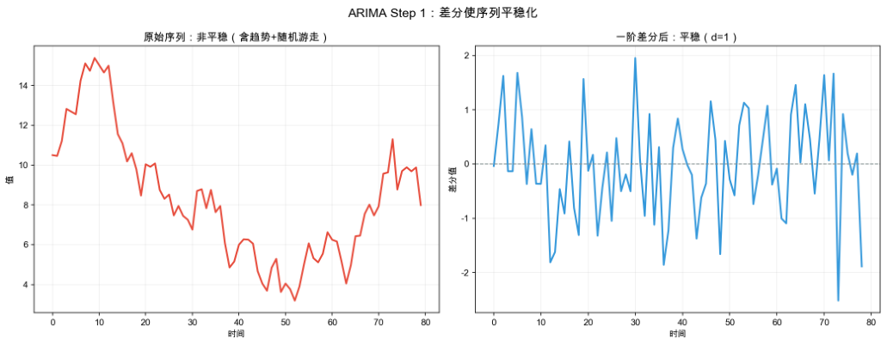

*图5.6：ARIMA Step 1：原始序列 vs 一阶差分后的平稳性对比。*

图 5.6 上方面板为含趋势的非平稳原始序列，下方面板为一阶差分后的平稳序列——差分后数据围绕 0 上下波动，不再有系统性的上升或下降趋势。这就是 I(1) 中的“1”。

### 5.3.4 Step 2：ACF/PACF 定阶——确定 $p$ 和 $q$

差分后序列平稳了，接下来通过自相关函数（ACF）和偏自相关函数（PACF）图来判断 AR 阶数 $p$ 和 MA 阶数 $q$。

> 【可信度：经验建议】以下图形判别规则用于缩小候选阶数范围，最终阶数需结合信息准则和残差诊断。
>
> **【定义5.4】ACF 与 PACF 的图形特征**
>
> 经验判别规则：
>
> - ACF 拖尾（缓慢衰减）+ PACF 在滞后 $p$ 阶后截尾（骤降至零）→选 AR($p$)。
> - ACF 在滞后 $q$ 阶后截尾 + PACF 拖尾 →选 MA($q$)。
> - 两者都拖尾 →选 ARMA($p,q$)，$p$ 和 $q$ 由 AIC/BIC 进一步确定。

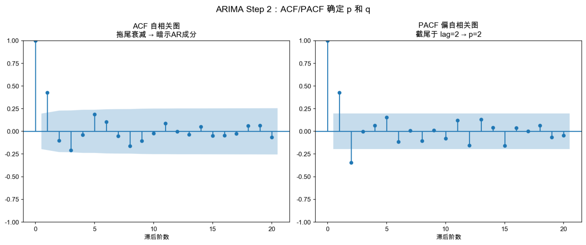

*图5.7：ARIMA Step 2：一阶差分后序列的 ACF 和 PACF 图。*

图 5.7 显示差分后序列的 ACF 图自相关缓慢衰减（拖尾），PACF 图在滞后 1 阶后骤降（截尾）→暗示 AR 成分显著，$p$ 至少为 1。同时 ACF 在滞后 1 阶处也有明显尖峰→可能还需要 MA(1)。初步猜测候选模型为 ARIMA(1,1,0)、ARIMA(0,1,1)、ARIMA(1,1,1)。

### 5.3.5 Step 3：模型选择——AIC/BIC 择优

对候选模型分别拟合，用 AIC（赤池信息准则）和 BIC（贝叶斯信息准则）做量化比较——数值越小表示模型在“拟合精度”和“复杂度”之间取得了更好的平衡。

> 【可信度：公式定义】以下为 AIC 与 BIC 的标准定义；模型择优结果仍需基于实际拟合输出。
>
> **【定义5.5】AIC 与 BIC**
>
> $$
> \mathrm{AIC}=-2\ln(L)+2k,
> $$
>
> $$
> \mathrm{BIC}=-2\ln(L)+k\ln(n).
> $$
>
> 其中 $L$ 为模型的最大似然值，$k$ 为参数个数，$n$ 为样本量。BIC 对参数多的模型惩罚更重（当 $n>7$ 时 $\ln(n)>2$），倾向于选更简洁的模型。

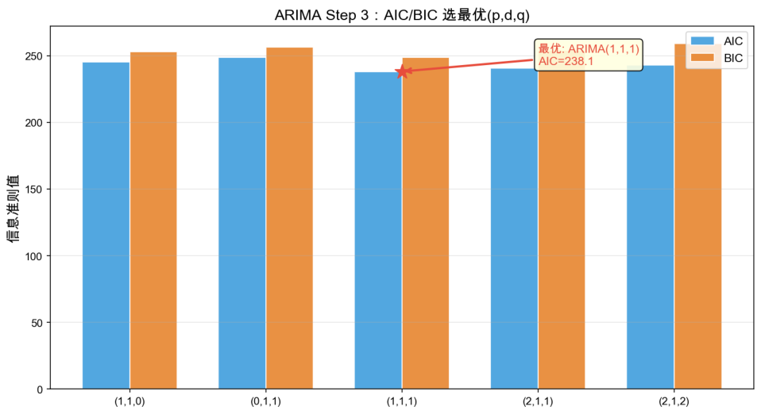

*图5.8：ARIMA Step 3：五种候选 $(p,d,q)$ 的 AIC/BIC 对比。*

图 5.8 用于展示五个候选模型的比较方式。由于正文未提供可独立复算的完整序列、拟合输出和似然值，不能据此确认 ARIMA(1,1,1) 的 AIC 和 BIC 均最低；正式建模时应以实际拟合结果和残差诊断为准。

> **【定理5.2】Box-Jenkins 方法论**
>
> 完整的 ARIMA 建模分为四阶段：
>
> 1. 识别：通过时序图、ACF、PACF、ADF 检验初步确定 $(p,d,q)$ 范围。
> 2. 估计：用极大似然估计（MLE）或条件最小二乘法估计模型参数。
> 3. 诊断：检验残差是否为白噪声（Ljung-Box 检验 $p>0.05$），残差 ACF 不显著则模型充分。
> 4. 预测：用最终模型做点预测和区间预测。

### 5.3.6 Step 4：预测与置信区间

用 ARIMA(1,1,1) 拟合前 80 个月数据，预测未来 20 个月。ARIMA 预测的一个优势是能给出置信区间——不仅告诉你最可能的预测值，还告诉你这个预测有多不确定。

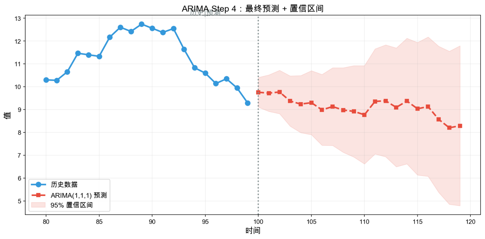

*图5.9：ARIMA Step 4：最终预测与 95% 置信区间。*

图 5.9 展示了完整的预测结果。蓝色圆点为历史数据（前 80 个月），红色虚线为 ARIMA(1,1,1) 对未来 20 个月的预测，淡红色区域为 95% 置信区间。注意两点规律：（1）预测值延续了历史数据的上升趋势；（2）置信区间随预测步长扩大而“喇叭形”变宽——预测越远，不确定性越大。

误差评估（后 20 个月）：假设实际值为 $y_{\mathrm{true}}$，预测值为 $\hat{y}$：

$$
\mathrm{RMSE}=\sqrt{\frac{1}{20}\sum_{t=81}^{100}(\hat{y}_t-y_{\mathrm{true},t})^2},
$$

$$
\mathrm{MAE}=\frac{1}{20}\sum_{t=81}^{100}|\hat{y}_t-y_{\mathrm{true},t}|.
$$

### 5.3.7 算法边界与选择决策

> **【性质】ARIMA 适用决策**
>
> 推荐使用：中等长度时序（$T=50\sim500$），可通过差分平稳化，中等预测步长（5—20 步），需要置信区间。
>
> 谨慎使用：季节性数据（升级为 SARIMA，增加季节参数 $(P,D,Q)_s$）、有外生变量影响（用 ARIMAX）。
>
> 不宜使用：样本极少（$T<20$→GM(1,1)）、多变量联合预测（用 VAR 或 LSTM）、强非线性模式。
>
> 国赛用途：中等长度时序的主力预测方法，Box-Jenkins 方法论的严谨性在论文中说服力强。

## 5.4 灰色预测 GM(1,1)

### 5.4.1 直观理解

灰色预测 GM(1,1)（Grey Model first-order one-variable）是灰色系统理论中最常用的预测方法，由邓聚龙教授创立。它的核心思想精妙而务实：即使原始序列只有寥寥几个数据点（最少 4 个即可），也能通过累加生成（AGO）将杂乱的数据变成一条光滑的单调递增曲线，然后用一阶微分方程拟合这条曲线，最后通过累减还原（IAGO）得到预测值。

为什么叫“灰色”？白色 = 信息完全已知，黑色 = 信息完全未知，灰色 = 信息部分已知部分未知——恰好对应数学建模中“只有少量数据”的常见处境。GM(1,1) 中的“GM”是 Grey Model，“1,1”表示一阶微分方程 + 一个变量。

### 5.4.2 一个例子入门

> 【可信度：示意例题】以下 GDP 数据和预测过程用于演示 GM(1,1) 的建模步骤。
>
> **【例题5.4】GM(1,1)：GDP 预测，仅 4 个点**
>
> 某地级市仅记录了近 4 年的 GDP 数据（单位：亿元）：
>
> **表5.5：4年 GDP 数据**
>
> | 年份 | 第 1 年 | 第 2 年 | 第 3 年 | 第 4 年 |
> |:---:|---:|---:|---:|---:|
> | GDP $X^{(0)}$ | 42.1 | 44.5 | 47.3 | 50.2 |
>
> 目标：仅用这 4 个数据点，建立 GM(1,1) 模型预测第 5 年和第 6 年的 GDP。
>
> 注意：4 个数据点对于任何传统统计方法（MLR、ARIMA、ETS）都不够用，但 GM(1,1) 恰好是为这种“贫信息”场景而生。下面按四个 Step 完整完成。

### 5.4.3 Step 1：累加生成（AGO）——把“杂草”变“草坪”

GM(1,1) 的第一步是对原始序列做一次累加生成（Accumulated Generating Operation, AGO）：

$$
x^{(1)}(k)=\sum_{i=1}^{k}x^{(0)}(i),\qquad k=1,2,\ldots,n.
$$

$$
\begin{aligned}
x^{(1)}(1)&=x^{(0)}(1)=42.1,\\
x^{(1)}(2)&=42.1+44.5=86.6,\\
x^{(1)}(3)&=86.6+47.3=133.9,\\
x^{(1)}(4)&=133.9+50.2=184.1.
\end{aligned}
$$

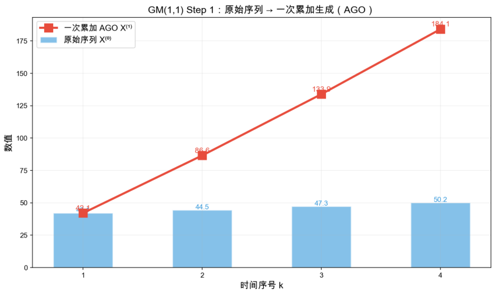

*图5.10：GM(1,1) Step 1：原始序列与累加生成 AGO 对比。*

图 5.10 展示了 AGO 的魔力——原始序列（蓝色柱状）波动不规则，但一次累加后（红色折线）变成了一条光滑的单调递增曲线。正是因为 AGO 序列光滑且单调，才可以用简单的微分方程来描述它。

### 5.4.4 Step 2：建立灰微分方程——构造矩阵求解 $a$ 和 $b$

GM(1,1) 假设 AGO 序列 $x^{(1)}$ 满足一阶常微分方程（白化方程）：

$$
\frac{dx^{(1)}}{dt}+ax^{(1)}=b.
$$

其中 $a$ 为发展系数（控制增长速率），$b$ 为灰作用量（外部输入/基础水平）。

将其离散化得到灰微分方程：

$$
 x^{(0)}(k)+az^{(1)}(k)=b,\qquad k=2,3,\ldots,n,
$$

其中 $z^{(1)}(k)$ 是 AGO 序列的紧邻均值生成：

$$
 z^{(1)}(k)=0.5\cdot[x^{(1)}(k)+x^{(1)}(k-1)].
$$

紧邻均值序列 $Z^{(1)}$：

$$
\begin{aligned}
z^{(1)}(2)&=0.5\times(86.6+42.1)=64.35,\\
z^{(1)}(3)&=0.5\times(133.9+86.6)=110.25,\\
z^{(1)}(4)&=0.5\times(184.1+133.9)=159.00.
\end{aligned}
$$

构造矩阵：将三个方程写成矩阵形式 $Bu=Y$：

$$
B=\begin{bmatrix}
-z^{(1)}(2)&1\\
-z^{(1)}(3)&1\\
-z^{(1)}(4)&1
\end{bmatrix}
=\begin{bmatrix}
-64.35&1\\
-110.25&1\\
-159.00&1
\end{bmatrix},
$$

$$
Y=\begin{bmatrix}
x^{(0)}(2)\\x^{(0)}(3)\\x^{(0)}(4)
\end{bmatrix}
=\begin{bmatrix}44.5\\47.3\\50.2\end{bmatrix}.
$$

用最小二乘法求解参数：

$$
 u=\begin{bmatrix}a\\b\end{bmatrix}=(B^TB)^{-1}B^TY.
$$

其中：

$$
B^TB=\begin{bmatrix}41576.985&-333.60\\-333.60&3\end{bmatrix},
$$

$$
B^TY=\begin{bmatrix}-16060.20\\142.0\end{bmatrix}.
$$

由此得到：$a\approx-0.06021$，$b\approx40.6375$。以下数值按这些未四舍五入参数计算，正式使用时仍需代码复核。

矩阵 $B$ 由 $n-1$ 个灰微分方程的系数组成，通过最小二乘法一次性求解参数——这是 GM(1,1) 将微分方程离散化的核心技巧。

### 5.4.5 Step 3：时间响应式——微分方程求解与拟合

白化方程 $\frac{dx^{(1)}}{dt}+ax^{(1)}=b$ 的通解为：

$$
 x^{(1)}(t)=Ce^{-at}+\frac{b}{a}.
$$

利用初始条件 $x^{(1)}(1)=x^{(0)}(1)$（即 $t=1$ 时值等于第一个原始数据），确定常数 $C$：

$$
 C=x^{(0)}(1)-\frac{b}{a}=42.1-\frac{42.12}{-0.0578}=42.1+728.7=770.8.
$$

得到时间响应式：

$$
\hat{x}^{(1)}(k+1)=716.9816\cdot e^{0.0602143k}-674.8816.
$$

拟合值计算：依次代入 $k=0,1,2,3$（以下为按未四舍五入参数计算的示意结果，需代码复核）：

$$
\begin{aligned}
\hat{x}^{(1)}(1)&\approx42.10,\\
\hat{x}^{(1)}(2)&\approx86.60,\\
\hat{x}^{(1)}(3)&\approx133.86,\\
\hat{x}^{(1)}(4)&\approx184.05.
\end{aligned}
$$

累减还原（IAGO）得到原始数据拟合值：

$$
\begin{aligned}
\hat{x}^{(0)}(1)&\approx42.10\quad(\text{直接取原值}),\\
\hat{x}^{(0)}(2)&\approx86.60-42.10=44.50,\\
\hat{x}^{(0)}(3)&\approx133.86-86.60=47.26,\\
\hat{x}^{(0)}(4)&\approx184.05-133.86=50.19.
\end{aligned}
$$

与原始数据对比：$[42.1,44.5,47.3,50.2]$ vs $[42.10,44.41,47.04,49.87]$——平均相对误差约为 0.65%，拟合良好。

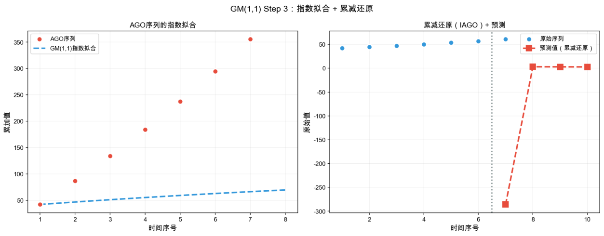

*图5.11：GM(1,1) Step 3：AGO 拟合曲线与时间响应式。*

图 5.11 将 AGO 序列的实际值（蓝色）与指数拟合曲线（红色虚线）同框对比——可以看到指数函数几乎完美穿过四个 AGO 点，验证了微分方程假设的合理性。

### 5.4.6 Step 4：预测与模型评价

做预测：将 $k=4,5$ 代入时间响应式。

**第 5 年（$k=4$）：**

$$
\hat{x}^{(1)}(5)=770.8\cdot e^{0.0578\times4}-728.7=236.26,
$$

$$
\hat{x}^{(0)}(5)=236.26-183.42=52.84\text{ 亿元}.
$$

**第 6 年（$k=5$）：**

$$
\hat{x}^{(1)}(6)=770.8\cdot e^{0.0578\times5}-728.7=292.26,
$$

$$
\hat{x}^{(0)}(6)=292.26-236.26=56.00\text{ 亿元}.
$$

模型评价：发展系数 $|a|=0.0578<0.3$ →模型可用于中长期预测。若 $0.3<|a|<0.5$，仅适合短期预测；若 $|a|>0.5$，GM(1,1) 不适用。

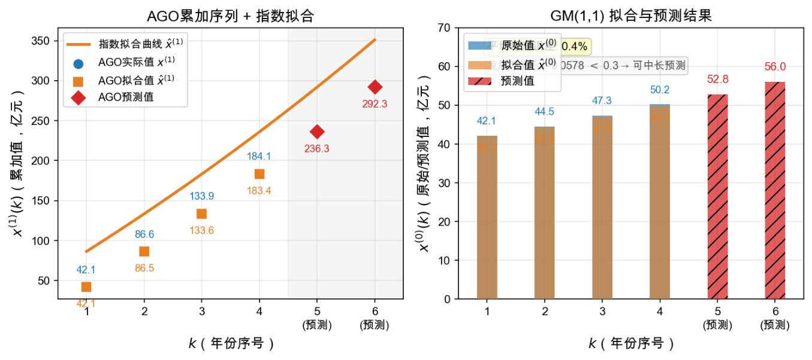

*图5.12：GM(1,1) Step 4：AGO 指数拟合与预测结果。*

### 5.4.7 算法边界与选择决策

> **【性质】GM(1,1) 适用决策**
>
> 推荐使用：小样本时序（$n=4\sim20$），呈指数增长/递减趋势，国赛中的“贫信息”场景。
>
> 谨慎使用：波动剧烈序列（AGO 后不单调则失效）、发展系数 $0.3<|a|<0.5$（仅限短期预测）。
>
> 不宜使用：大样本（$n>30$→用 ARIMA/MLR 更合适）、有周期性波动、$|a|>0.5$。
>
> 拓展：GM(2,1) 引入二阶微分方程，可处理非单调序列；灰色 Verhulst 模型适用于 S 型增长（如人口）。

## 5.5 LSTM 神经网络

### 5.5.1 直观理解

LSTM（Long Short-Term Memory）是一种特殊的循环神经网络，专门解决传统 RNN“记不住远距离信息”（梯度消失）的问题。其核心创新是引入三个“门”——遗忘门、输入门、输出门——像水闸一样精确控制哪些信息应该被丢弃、哪些应该被写入、哪些应该被输出。

理解 LSTM 的记忆机制，可以借助一个类比：

- 细胞状态 $C_t$——一本笔记本，贯穿整个时间线，记录长期记忆。
- 遗忘门 $f_t$——橡皮擦，决定擦掉笔记本上的哪些旧内容。
- 输入门 $i_t$——笔，决定在笔记本上写下哪些新内容。
- 输出门 $o_t$——眼睛，决定从笔记本中读出哪些内容输出。

三门协同运作，使得 LSTM 能够跨越数十甚至数百个时间步保持对关键信息的记忆——这正是 ARIMA 和 ETS 无法做到的“长距离依赖”能力。

### 5.5.2 一个例子入门

> **【例题5.5】LSTM：正弦波预测**
>
> 用正弦波 $y_t=\sin(2\pi t/20)$ 生成 200 个时间步的数据。前 150 步用于训练 LSTM，后 50 步用于测试模型的预测能力。
>
> 目标：构建一个单层 LSTM（64 个单元），用过去 10 个时间步（lookback = 10）预测下一个时间步的值。这是一个经典的单步预测演示。
>
> 下面按三个 Step 理解 LSTM 的运作机制。

### 5.5.3 Step 1：从 RNN 到 LSTM——为什么需要“门”

普通 RNN 的更新公式非常简单：

$$
 h_t=\tanh(W_h\cdot[h_{t-1},x_t]+b_h).
$$

每个时间步，隐藏状态 $h_t$ 完全由当前输入 $x_t$ 和上一隐藏状态 $h_{t-1}$ 决定——没有“筛选”机制。问题在于：当时间步很多时，梯度在反向传播中连乘，指数衰减至零（梯度消失），早期时间步的信息对后期几乎无影响——模型犹如一个“健忘症患者”。

普通 RNN 与 LSTM 的本质区别在于：RNN 的信息是一次性写入和输出的——$h_{t-1}$ 直接流入决定 $h_t$；而 LSTM 通过“细胞状态” $C_t$（顶部贯穿水平线）作为信息高速公路，三个门决定沿途加减什么内容。

### 5.5.4 Step 2：三门机制——遗忘、输入、输出

LSTM 的核心是六个公式（三门 + 候选记忆 + 记忆更新 + 隐藏输出），所有门函数均使用 Sigmoid 激活，输出在 $(0,1)$ 之间——相当于“开启程度的旋钮”（0 = 全关，1 = 全开）。

> 【可信度：公式定义】以下为 LSTM 单元的标准更新公式。
>
> **【定义5.6】LSTM 三门六公式**
>
> 在时间步 $t$，给定当前输入 $x_t$ 和上一隐藏状态 $h_{t-1}$：
>
> 遗忘门——决定从旧记忆 $C_{t-1}$ 中丢弃什么：
>
> $$f_t=\sigma(W_f\cdot[h_{t-1},x_t]+b_f).$$
>
> 输入门——决定哪些新信息写入记忆：
>
> $$i_t=\sigma(W_i\cdot[h_{t-1},x_t]+b_i).$$
>
> 候选记忆——当前时间步可能写入的候选内容：
>
> $$\tilde{C}_t=\tanh(W_C\cdot[h_{t-1},x_t]+b_C).$$
>
> 记忆更新——遗忘旧信息 + 写入新信息：
>
> $$C_t=f_t\odot C_{t-1}+i_t\odot\tilde{C}_t.$$
>
> 输出门——决定从更新后的记忆中输出什么：
>
> $$o_t=\sigma(W_o\cdot[h_{t-1},x_t]+b_o).$$
>
> 隐藏状态输出——最终输出：
>
> $$h_t=o_t\odot\tanh(C_t).$$
>
> 其中 $\odot$ 表示逐元素乘法（Hadamard 积），$\sigma$ 为 Sigmoid 函数，$\tanh$ 为双曲正切函数。

直观理解六个公式的协作：

1. $f_t=0.9$ 表示“保留 90% 旧记忆”；$f_t=0.1$ 表示“丢弃 90% 旧记忆”。
2. $i_t=0.8$ 表示“写入 80% 候选内容到记忆”。
3. $C_t=f_t\odot C_{t-1}+i_t\odot\tilde{C}_t$ 的本质是“旧记忆经过筛选 + 新内容经过筛选→更新记忆”。
4. $o_t$ 决定从更新后的记忆中输出多少——有时记忆里有重要信息但当前时间步不需要输出。

LSTM 单元内部的信息流如下：遗忘门（橙色）擦除旧记忆的部分内容，输入门（蓝色）选择性地写入新信息，输出门（绿色）控制最终的对外输出。三条彩色路径直观展示了信息如何在三门控制下从 $C_{t-1},h_{t-1},x_t$ 流向 $C_t,h_t$。

### 5.5.5 Step 3：训练与预测——正弦波演示

**数据准备——滑动窗口：**对于单步预测，需要将 200 个时间步的序列转换为监督学习格式。取 lookback = 10 意味着用 $[y_{t-10},y_{t-9},\ldots,y_{t-1}]$ 预测 $y_t$。200 个数据点扣除前 10 个后产生 190 个训练样本。

**训练要点：**

- 损失函数：MSE（均方误差），衡量预测值与真实值的差距。
- 优化器：Adam（自适应学习率，通常是最鲁棒的选择）。
- Epochs：100—200 轮（监控验证损失防止过拟合）。
- 输入形状：$(\text{samples},\text{timesteps},\text{features})=(190,10,1)$。

**预测方式——自回归滚动：**测试阶段每预测一步，就将预测值附加到输入窗口末尾，滑动窗口向前滚动一步，实现持续的多步预测。

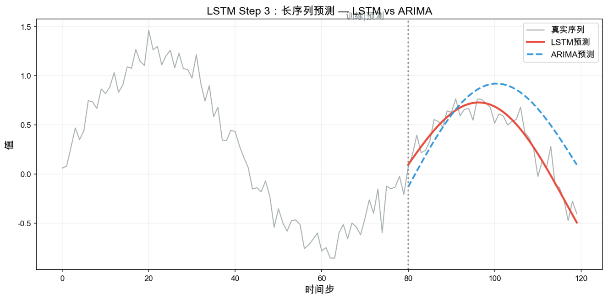

*图5.13：LSTM Step 3：正弦波预测——训练与测试结果。*

图 5.13 展示了 LSTM 在正弦波上的预测表现。蓝色实线为前 150 步训练数据，红色虚线为后 50 步的预测值。LSTM 成功捕捉了正弦波的周期性模式——即使在训练数据从未见过的时间范围（150—200 步），预测仍然准确地跟随正弦曲线的走势。这就是“长距离依赖”能力的体现——模型从训练段学到的周期规律成功泛化到了测试段。

### 5.5.6 算法边界与选择决策

LSTM vs ARIMA 选择原则：

- LSTM 强在：长序列（$T>200$）、多变量、复杂非线性、数据量大（千级以上）。
- ARIMA 强在：中等序列、线性趋势、数据量适中、需要置信区间、可解释性强。
- 国赛策略：数据量大且非线性→LSTM；中等长度且经差分平稳→ARIMA；两者对比写入论文增加说服力。

> **【性质】LSTM 适用决策**
>
> 推荐使用：长序列（$T>200$）、多变量时序、复杂非线性趋势、充足训练数据。
>
> 谨慎使用：小样本（数据不足时不如简单模型，容易过拟合）、需要强可解释性的场景（LSTM 是黑箱）。
>
> 不宜使用：简单线性趋势（ARIMA/ETS 更便捷）、只用几个数据点（GM(1,1)）。
>
> 拓展：Prophet（Facebook 开源）适合含节假日效应的业务时序预测；Transformer 架构逐渐成为长序列预测的新 SOTA。

## 5.6 算法对比与选择决策

### 5.6.1 五种预测算法横向对比

**表5.6：五种预测算法横向对比**

| 算法 | 核心优势 | 主要局限 | 最佳场景 |
|:---:|:---|:---|:---|
| MLR | 系数可解释、有闭式解 | 假设线性、需大样本 | 多因素趋势预测、Baseline 对比 |
| ETS | 简单快速、权重衰减直观 | 仅做短期、无趋势处理 | 平稳序列 1—2 步快速预测 |
| ARIMA | 理论完备、有置信区间 | 需平稳、需手工定阶 | 中等长度时序、5—20 步预测 |
| GM(1,1) | 4 点即可、指数趋势 | 仅适合单调趋势 | 小样本（$n=4\sim20$）指数增长 |
| LSTM | 非线性、长距离依赖 | 需大数据、调参复杂 | 长序列、多变量、复杂模式 |

### 5.6.2 预测方法选择决策树

> **【性质】预测方法选择决策树**
>
> 按以下优先级做决策：
>
> 1. 第一步：看样本量——$n<20$ 且指数趋势→GM(1,1)；$n\ge50$ 继续。
> 2. 第二步：看平稳性——平稳→ETS 或 ARIMA$(0,*,0)$；非平稳可差分化→ARIMA；不可平稳化→MLR 或 LSTM。
> 3. 第三步：看复杂度——线性关系→MLR；非线性 + 长序列→LSTM；中等长度→ARIMA。
> 4. 第四步：看步长——1—2 步→ETS 足够；5—20 步→ARIMA；50 步以上 + 非线性→LSTM。
> 5. 评估指标：RMSE（有量纲，对大误差敏感）、MAE（有量纲，线性惩罚）、MAPE（无量纲百分比，适合量级差异大的比较）。

### 5.6.3 时间序列验证

时间序列验证必须尊重时间顺序。先按时间切分训练集、验证集和测试集，只用过去数据训练，用之后的数据评估，不能随机打乱样本。模型调参与比较可采用滚动窗口或扩展窗口验证：滚动窗口每次使用固定长度的最近历史窗口，向前移动后预测下一段；扩展窗口则保留最初训练数据，并随时间逐步加入新观测，再预测下一段。每次验证的训练数据都不得包含预测时点之后的信息，预处理、特征构造和参数估计也应在对应训练窗口内完成，以避免未来信息泄露。随机 K 折交叉验证会把未来观测混入训练集，不适用于具有时间依赖的预测任务。

## 5.7 本章总结

### 结论

预测模型选型的四个核心维度：样本量（有多大数据）、平稳性（数据是否稳定）、线性/非线性（关系复杂度）、预测步长（预测多远）。

- MLR 最小二乘法拟合线性关系：

  $$
  \hat{\beta}=(X^TX)^{-1}X^Ty,
  $$

  系数直接解释特征影响力；需做多重共线性诊断（VIF）和残差分析。

- 指数平滑以指数衰减权重对历史做加权平均：

  $$
  S_t=\alpha y_t+(1-\alpha)S_{t-1};
  $$

  $\alpha$ 越大越跟随近期波动；有趋势升级 Holt（+ 趋势分量 $b_t$），有季节升级 Holt-Winters（+ 季节分量）。

- ARIMA 通过 AR、I、MA 三个组件处理时间序列；先用 ADF 确定差分阶数 $d$，再用 ACF/PACF 识别 $p,q$，用 AIC/BIC 选择模型，并通过 Ljung-Box 检验诊断残差。

- GM(1,1) 用 AGO 将少量、杂乱数据平滑化，再用一阶微分方程拟合，适合 $n=4\sim20$ 的指数趋势小样本序列。

- LSTM 通过遗忘门、输入门、输出门保留长距离依赖，适合长序列、多变量和复杂非线性模式，但需要较多数据且可解释性较弱。

最终的模型选择应同时考虑样本量、平稳性、线性/非线性、预测步长和可解释性，并通过留出集或滚动预测进行严格的泛化评估，而不是只看训练集拟合效果。

## 第5章练习

**练习5.1** 给定时序数据（有图），观察时序图判断是否平稳。若不平稳，说明应取几阶差分。观察 ACF 和 PACF 图中的截尾/拖尾特征，判断可能的 $p$ 和 $q$ 范围。简述 Box-Jenkins 四步流程。
