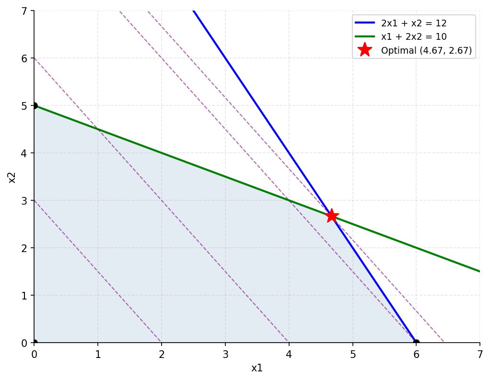
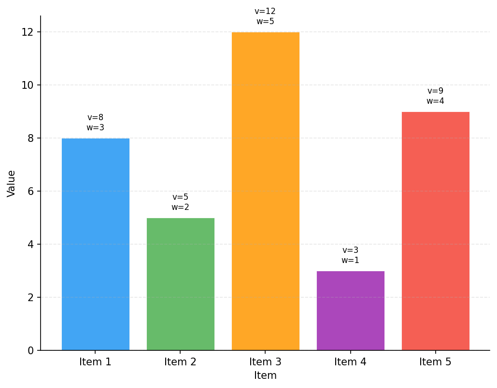
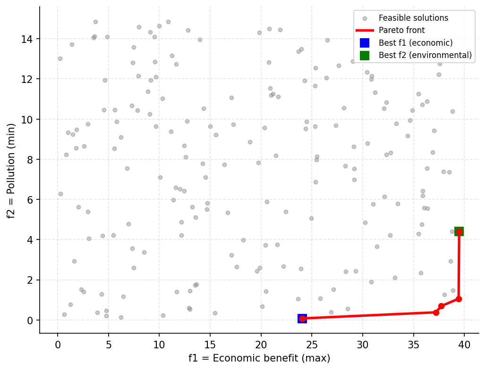
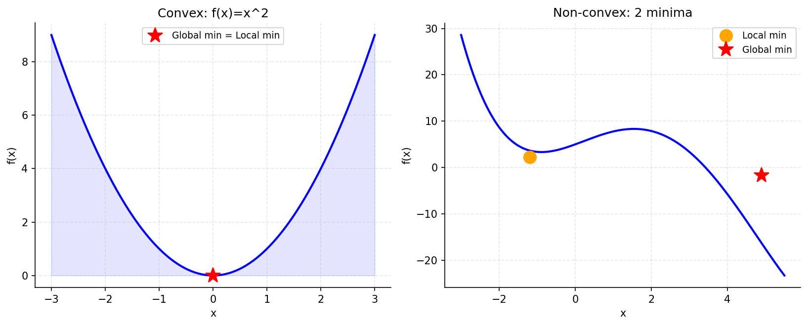
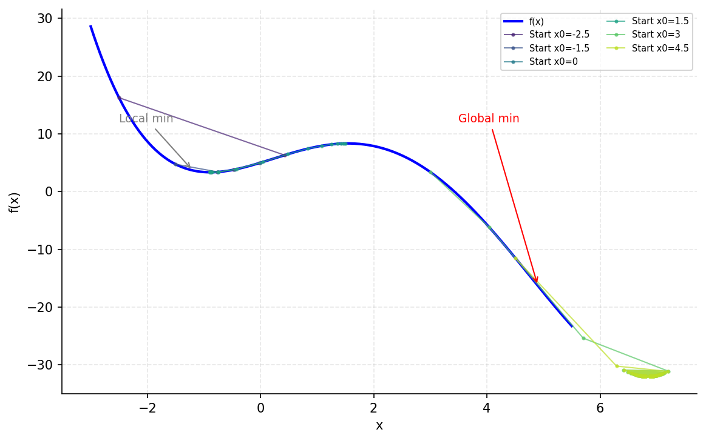
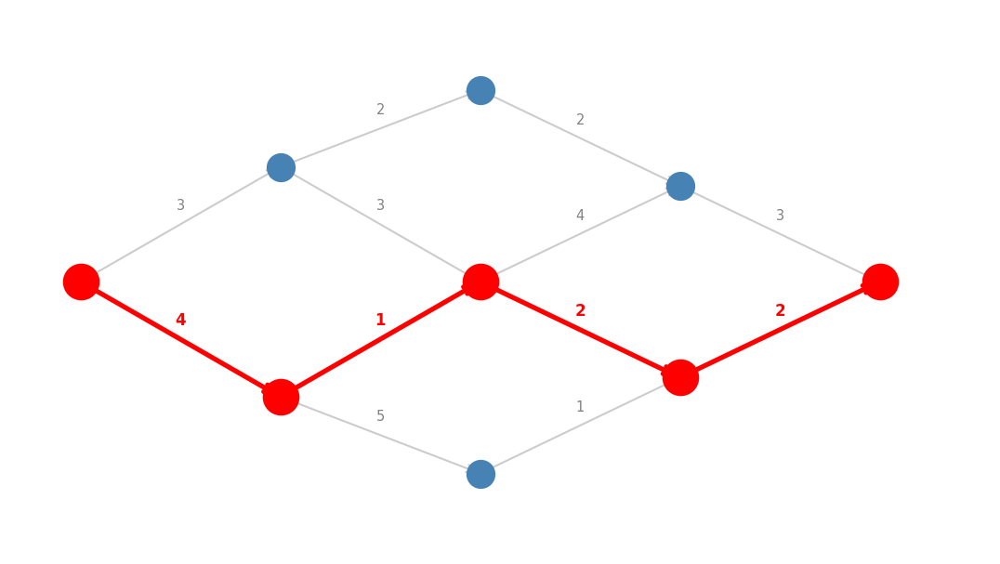
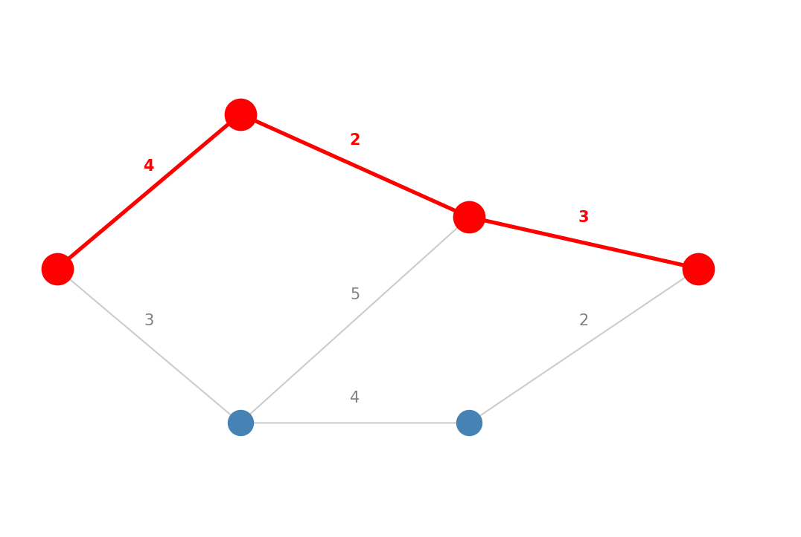
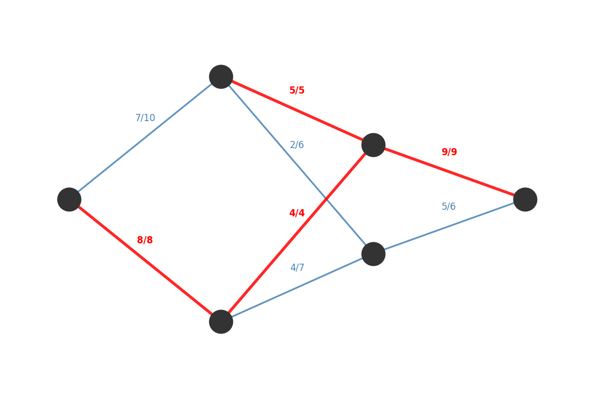
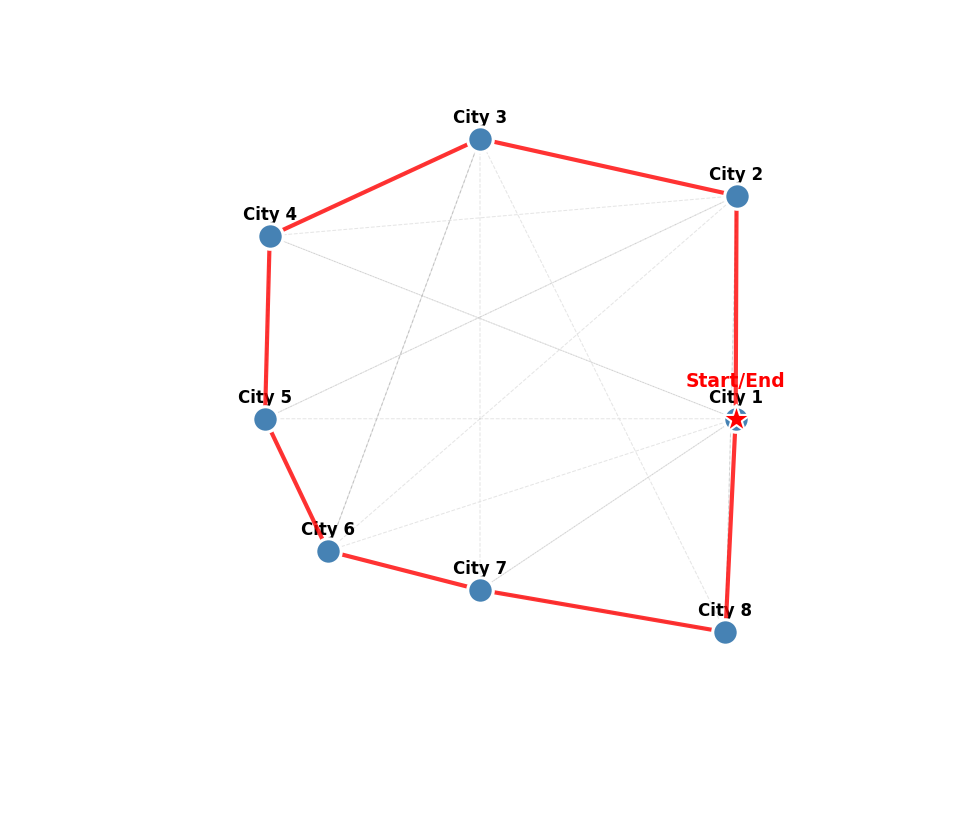

# 第6章 优化模型

## 内容提要

* 6.1 线性规划（LP）

* 6.2 整数规划（IP）

* 6.3 多目标规划（MOP）

* 6.4 非线性规划（NLP）

* 6.5 动态规划（DP）

* 6.6 图论与网络优化

* 6.7 算法对比与求解器选择

如果说评价模型是“从备选方案中选最优”，优化模型就是“从无限可能中设计最优”。优化问题是国赛 A 题和 B 题的绝对核心——资源分配、生产调度、路径规划、投资组合，本质上都是在约束条件下寻找最优决策。

> 【可信度：通用原理】以下三要素是优化建模的通用框架。
>
> **【定义 6.1】优化三要素**
>
> 所有优化问题的建模第一步都是识别三要素。无论线性、非线性、整数还是多目标，这个框架通用：
>
> | 三要素 | 含义 | 示例（工厂生产问题） |
> | --- | --- | --- |
> | 决策变量 | 你要决定什么？ | $x\_1$=甲产品产量，$x\_2$=乙产品产量 |
> | 目标函数 | 你要优化什么？ | $\max Z=3x\_1+2x\_2$（总利润最大化） |
> | 约束条件 | 你受什么限制？ | $2x\_1+x\_2\leq12$（原料 A），$x\_1+2x\_2\leq10$（原料 B），$x\_1,x\_2\geq0$ |

建模完成后第二步——选择合适的求解器：模型建好了不等于能求解。不同问题类型对应不同求解器，选错求解器轻则求解失败，重则得出错误结论。

## 6.1 线性规划（LP）

### 6.1.1 核心特征——与其他优化方法的本质区别

> 【可信度：通用原理】以下结论以可行域非空且目标函数、约束严格线性为前提。
>
> 线性规划在满足可行域非空且目标函数和约束均严格线性的前提下，具有全局最优性：可行域是凸集，任一局部最优解都是全局最优解；若存在最优解，则至少有一个最优解位于可行域顶点。LP 不是“唯一能保证全局最优解的多项式时间算法”，更严谨地说，线性规划属于可在标准输入与算术模型下用内点法等多项式时间方法求解的凸优化问题；单纯形法在实践中高效，但其最坏情形复杂度不保证为多项式时间。

> **笔记：LP vs IP 的关键区别**
>
> LP 的变量是连续实数，最优解 $B(4.67,2.67)$ 可以直接用。但如果题目要求“产量必须是整数件”，这个 LP 最优解就不能直接用，必须升级为 IP。四舍五入取 $(5,3)$ 可能违反约束，取 $(4,2)$ 可能离真正的最优整数解很远——这就是 IP 比 LP 难的根本原因。

> 【可信度：示意例题】以下产品、资源和利润数据用于演示线性规划建模流程。
>
> **【例题 6.1】LP：工厂产品组合优化**
>
> 某工厂生产甲、乙两种产品：
>
> **表6.1 产品生产信息**
>
> | 产品        | 利润（万元/件） | 消耗原料 A（吨/件） | 消耗原料 B（吨/件） |
> | --------- | -------: | ----------: | ----------: |
> | 甲（$x\_1$） |        3 |           2 |           1 |
> | 乙（$x\_2$） |        2 |           1 |           2 |
> | 总供应       |        — |          12 |          10 |

> **【定义 6.2】LP 模型建立**
>
> 决策变量：$x\_1$（甲产量），$x\_2$（乙产量），$x\_1,x\_2\geq0$。
>
> 目标函数：$\max Z=3x\_1+2x\_2$。
>
> 约束条件：$2x\_1+x\_2\leq12$（原料 A），$x\_1+2x\_2\leq10$（原料 B），$x\_1,x\_2\geq0$。

### 6.1.2 求解——单纯形法

目标函数 $Z=3x\_1+2x\_2$ 对应一族平行等值线。枚举顶点：$O(0,0)\rightarrow Z=0$，$A(6,0)\rightarrow Z=18$，$C(0,5)\rightarrow Z=10$，$B(4.67,2.67)\rightarrow Z\approx19.33$。$B$ 点最优。

*图 6.1：LP：蓝色区域为可行域，紫色虚线为等值线族，红星为最优顶点。*

单纯形法核心逻辑：从原点出发→计算改进方向→沿边界跳到相邻更优顶点（转轴操作）→重复直到无法改进。每次转轴只考虑相邻顶点，效率远高于全枚举。路径：$(0,0)\rightarrow(6,0)\rightarrow(4.67,2.67)$，两步即达最优。

### 6.1.3 求解器选择

**表6.2 LP 求解器选择指南**

| 求解器                      | 适用规模                | 使用方式             |
| ------------------------ | ------------------- | ---------------- |
| `scipy.optimize.linprog` | 变量 $<100$，约束 $<100$ | `linprog` 求解器    |
| `pulp`（Python）           | 变量 $<1000$          | 建模语言，可读性好，自动选求解器 |
| `or-tools`（Google）       | 变量 $<10000$         | 工业级，支持多种算法切换     |

## 6.2 整数规划（IP）

### 6.2.1 核心特征——IP 与 LP 的本质差异

> 【可信度：通用原理】复杂度结论针对一般整数规划；具体实例仍取决于结构和规模。
>
> IP 在 LP 上增加整数约束，问题从多项式时间可解跃升为 NP-hard。

> **笔记：为什么 IP 不能“先解 LP 再四舍五入”？**
>
> LP 最优解可能包含非整数变量，直接四舍五入既可能违反约束，也不保证得到整数规划最优解。本例的 LP 最优解为 $(4.67,2.67)$；四舍五入为 $(5,3)$ 会违反约束，取 $(4,2)$ 虽可行但 $Z=16$，真正的最优整数解为 $(4,3)$，$Z=18$。离 LP 最优解最近的整数点不一定是原整数规划问题的最优解。

> 【可信度：示意例题】以下物品数据和求解过程用于演示 0-1 背包模型。
>
> **【例题 6.2】0-1 背包问题**
>
 > 5 件物品，每件选（1）或不选（0），总重 $\leq10$ kg 时使总价值最大：
>
> **表6.3 物品重量和价值**
>
> | 物品            |  1 |  2 |  3 |  4 |  5 |
> | ------------- | -: | -: | -: | -: | -: |
> | 重量 $w\_i$（kg） |  3 |  2 |  5 |  1 |  4 |
> | 价值 $v\_i$（￥）  |  8 |  5 | 12 |  3 |  9 |

> **【定义 6.3】0-1 背包模型**
>
> 决策变量：$x\_i\in{0,1}$，$i=1,\ldots,5$。
>
> 目标函数：$\max Z=8x\_1+5x\_2+12x\_3+3x\_4+9x\_5$。
>
> 约束条件：$3x\_1+2x\_2+5x\_3+x\_4+4x\_5\leq10$，$x\_i\in{0,1}$。

与 LP 的唯一区别是最后一行的 ${0,1}$ 整数约束——其余部分完全相同。

*图 6.2：背包问题：5 件物品的价值与重量，最优选择为物品 1+2+3。*

### 6.2.2 求解——分支定界法

> **【定义 6.4】分支定界法**
>
> \*\*Step 1——松弛（求上界）：\*\*忽略整数约束，把 $x\_i\in{0,1}$ 放宽为 $0\leq x\_i\leq1$，变成 LP 求解。LP 最优值给出原问题的上界。
>
> \*\*Step 2——分支：\*\*若 LP 解含非整数变量（如 $x\_5=0.25$），分裂为两个子问题——左支 $x\_5=0$，右支 $x\_5=1$。递归形成搜索树。
>
> \*\*Step 3——定界与剪枝：\*\*满足任一条件即可剪掉该分支：（1）子问题不可行；（2）LP 值≤当前已知最优整数解值；（3）LP 解已是全整数→更新最优解。

本例手工跟踪——完整分支过程：

**表6.4 分支定界求解过程——每一步的节点状态**

| 节点 | LP 松弛解 | $Z\_{LP}$ | 状态 | 操作与推理 |
| --- | --- | ---: | --- | --- |
| $P\_0$ | $x=(1,1,1,0,0.25)$ | 26 | 非整数 | $x\_5=0.25$ 非整数 → 分支：左 $x\_5=0$，右 $x\_5=1$ |
| $P\_1$（左） | $x=(1,1,1,0,0)$ | 25 | 全整数 | 合法 0-1 解！更新下界 =25，剪枝 |
| $P\_2$（右） | $x=(1,0.67,1,0,1)$ | 25.35 | 非整数 | 25.35>25，可能含更优解 → 继续分支 $x\_2$ |
| $P\_3$（左） | $x=(1,0,1,0,1)$ | 25 | 全整数 | $Z=25=$ 下界，不优于 P1，剪枝 |
| $P\_4$（右） | 无解（超重） | — | 不可行 | 总重 14>10，约束违反，剪枝 |

解读每一步：

> * $P\_0$：松弛后 $x\_5=0.25$（物品5只“选25%”）不是合法 0-1 解。上界 $Z=26$ 说明最优不可能超26。选 $x\_5$ 分支——唯一非整数变量。
>
> * $P\_1$：强制不选物品5后，LP 恰好给出全整数解 $(1,1,1,0,0)$，$Z=25$。全整数意味着这是原 IP 的合法可行解——立即记录为当前最优，下界=25。该分支无需继续——剪枝。
> * $P\_2$：强制选物品5（4kg）后，容量紧张，LP 给出 $x\_2=0.67$。上界25.35>25说明此分支可能有比25更好的解——继续分支。
> * $P\_3$：不选物品2，LP 得 $(1,0,1,0,1)$ 全整数，$Z=25=$下界——不优于P1，剪枝。
> * $P\_4$：选物品2+5，剩余容量仅4kg，装不下物品1（3kg）+物品3（5kg）的任何组合——LP确认不可行，剪枝。

结论：全枚举 $2^5=32$ 种，分支定界仅探索5个节点即得最优——选物品1+2+3，总重10kg，总价值￥25。

### 6.2.3 求解器选择

**表6.5 IP 求解器选择指南**

| 求解器               | 适用场景            | 特点                  |
| ----------------- | --------------- | ------------------- |
| `pulp` + CBC      | 变量 $<500$，中小规模  | Python 建模，免费开源，比赛首选 |
| `or-tools` CP-SAT | 变量 $<5000$，约束复杂 | Google 出品，约束规划引擎强   |
| `gurobipy`        | 商业级大规模          | 分支定界+割平面+启发式        |

## 6.3 多目标规划（MOP）

### 6.3.1 核心特征——MOP 与单目标优化的本质差异

LP/IP/NLP/DP 只有一个目标函数，MOP 同时处理多个互相冲突的目标。

> **笔记：MOP vs 单目标的核心区别**
>
> 单目标→输出一个最优解。MOP→输出一组 Pareto 最优解（前沿）。最终选哪个是决策者的事，MOP 的角色是清晰展示所有可行权衡。
>
> Pareto 最优：一个解是 Pareto 最优的，当且仅当不存在另一个可行解在所有目标上都不比它差、且至少在一个目标上严格更好。

> 【可信度：示意例题】以下目标函数、约束和前沿解读用于演示多目标规划方法。
>
> **【例题 6.3】双目标：经济 vs 环保规划**
>
> 产品产量 $(x\_1,x\_2)$：$\max f\_1=10x\_1+8x\_2$（经济），$\min f\_2=3x\_1+5x\_2$（污染）。约束：$2x\_1+x\_2\leq8$，$x\_1+2x\_2\leq6$。

> **【定义 6.5】双目标 MOP 模型**
>
> 决策变量：$x\_1,x\_2\geq0$。
>
> 目标（两个，冲突）：$\max f\_1=10x\_1+8x\_2$；$\min f\_2=3x\_1+5x\_2$。
>
> 约束：$2x\_1+x\_2\leq8$，$x\_1+2x\_2\leq6$。

单目标分别优化：纯经济 $(4,0)$，$f\_1=40$，$f\_2=12$；纯环保 $(0,0)$，$f\_1=0$，$f\_2=0$——两个最优解完全不同，冲突已量化证实。

### 6.3.2 求解——加权法+Pareto 前沿

加权法：统一方向+量纲归一化后，构造

$$
\min F=w\_1(-f\_1)+w\_2f\_2,\qquad w\_1+w\_2=1。
$$

扫描 $w\in\[0,1]$，每步求解一个单目标 LP，得到 Pareto 前沿上的一个点。

*图 6.3：MOP：灰色点为可行解，红线为 Pareto 前沿。*

前沿解读：从左下到右上的走向说明“经济收益的代价是污染”。陡峭处→牺牲一点经济换来大量环保改善（性价比高）；平坦处→牺牲经济换不来多少环保（性价比低）。

### 6.3.3 国赛实战

> **笔记：MOP 实战三步法（第 3 章联动）**
>
> 1. \*\*标量化：\*\*加权法（偏好明确）或 ε-约束法（某目标有硬性达标要求）。
> 2. \*\*生成前沿：\*\*扫描权重→画散点图，展示权衡全貌。
> 3. \*\*方案推荐：\*\*用 TOPSIS 从 Pareto 前沿中选综合最优方案。
>
> 注意：加权法只能生成凸前沿上的点。前沿非凸时用 ε-约束法或 NSGA-II（第 7 章）。

## 6.4 非线性规划（NLP）

### 6.4.1 核心特征——NLP 与 LP/IP 的本质差异

> 【可信度：通用原理】非凸非线性规划通常不提供全局最优保证；凸性等附加结构会改变这一结论。
>
> NLP 舍弃线性假设，目标或约束可含 $x^2$、$e^x$、$\sin x$ 等任意非线性项，建模能力极大拓展但丧失全局最优保证。

*图 6.4：凸函数（左）：局部最优=全局最优；非凸函数（右）：有多个谷底。*

> **笔记：NLP 的核心挑战——局部最优≠全局最优**
>
> LP 的可行域是凸多边形→任意局部最优就是全局最优。NLP 的可行域可能非凸→梯度下降走到“脚下最近的谷底”就停了，未必是最低那个谷底。除非能证明函数是凸的，否则不能单次求解就宣称全局最优。

> 【可信度：示意例题】函数、区间及驻点数值用于演示非凸优化风险；驻点和最优值需以代码复核。
>
> **【例题 6.4】NLP：非凸函数**
>
> $f(x)=0.08x^4-0.8x^3+0.5x^2+3x+5$，$x\in\[-3,5]$。$f''(x)=0.96x^2-4.8x+1$ 在区间内变号，函数非凸。以下驻点、函数值和全局极小点均为示意数值，需以代码复核，不作为已核验的数值结论。

> **【定义 6.6】NLP 模型**
>
> 决策变量：$x\in\[-3,5]$。
>
> 目标函数：$\min f(x)=0.08x^4-0.8x^3+0.5x^2+3x+5$。
>
> 约束条件：$x\in\[-3,5]$。

### 6.4.2 求解——梯度下降+多点启动

梯度下降：

$$
 x\_{k+1}=x\_k-\eta\cdot f'(x\_k)。
$$

学习率 $\eta$ 控步长。

从 $x\_0=3$ 出发可收敛到全局最优 $x\approx4.9$。但从 $x\_0=0$ 出发可能收敛到局部极小点 $x\approx-1.2$（相差 4 个单位）。这就是起点依赖。

*图 6.5：NLP：6 个起点的梯度下降，右侧两点到达全局最优，其余陷于局部。*

多点启动——常用的风险缓解策略：均匀撒多个初始点，各自运行梯度下降，取其中目标值较好的结果，但仍不能据此证明全局最优。凸性检验：在可微问题中可检查 Hessian 是否在可行域内处处半正定；若目标函数与可行域满足相应凸性条件，可讨论全局最优性，否则应结合多点启动、全局启发式或求解器结果进行复核。

**表6.6 NLP 求解器选择**

| 求解器                            | 适用场景        | 特点               |
| ------------------------------ | ----------- | ---------------- |
| `scipy.optimize.minimize`      | 凸/非凸，中小规模   | BFGS、SLSQP（支持约束） |
| `scipy.basinhopping`           | 非凸全局优化      | 多点启动+局部优化，国赛推荐   |
| `scipy.differential_evolution` | 非凸，变量 $<50$ | 差分进化，不需梯度        |

## 6.5 动态规划（DP）

### 6.5.1 核心特征——DP 与其他方法的本质差异

LP/IP/NLP 是“静态优化”——所有决策变量一次性确定。DP 处理多阶段序贯决策——决策按时间顺序逐个做出，当前决策影响后续所有阶段的选择空间。

> **笔记：DP vs 其他优化方法**
>
> LP/IP/NLP→一次性求解所有变量。DP→从最后阶段倒着算，每个阶段的最优决策依赖于后面阶段已算好结果。这种“逆向递推”是 DP 特有的思维方式。
>
> DP 的两个前提：（1）最优子结构——子问题最优推得全局最优；（2）无后效性——当前状态确定后，历史不再影响未来。

> 【可信度：示意例题】以下节点、边权和路径结果用于演示动态规划递推流程。
>
> **【例题 6.5】DP：4 阶段最短路径 DAG**
>
> $S\rightarrow T$ 共 12 条路径，边上数字为距离。求最短路径。

> **【定义 6.7】DP 模型**
>
> 决策变量：每个阶段选去哪（非一次选完所有边，而是递推地每阶段选一次）。
>
> 目标函数：$\min\sum r\_k$（路径总距离，必须可加）。
>
> 约束：阶段 0=$S\rightarrow$1=$A\_1,A\_2\rightarrow$2=$B\_1,B\_2,B\_3\rightarrow$3=$C\_1,C\_2\rightarrow$4=$T$。

### 6.5.2 求解——Bellman 逆向递推

> 【可信度：公式定义】以下是满足相应状态转移和最优子结构条件时的 Bellman 递推定义。
>
> **【定义 6.8】Bellman 方程**
>
> $$
> f\_k(s\_k)=\min\_{s\_{k+1}}{r(s\_k,s\_{k+1})+f\_{k+1}(s\_{k+1})},\qquad f\_N(T)=0。
> $$
>
> 逆向推（$T\rightarrow S$）：
>
> * 阶段 3→4：$f(C\_1)=3$，$f(C\_2)=2$。
>
> * 阶段 2→3：$f(B\_1)=2+3=5$，$f(B\_2)=\min(4+3,2+2)=4$，$f(B\_3)=1+2=3$。
>
> * 阶段 1→2：$f(A\_1)=\min(2+5,3+4)=7$，$f(A\_2)=\min(1+4,5+3)=5$。
>
> * 阶段 0→1：$f(S)=\min(3+7,4+5)=9$。
>
> 正向回溯：$S\rightarrow A\_2\rightarrow B\_2\rightarrow C\_2\rightarrow T$，总距离=9。
>
> 效率：全枚举 12 条路径，DP 计算 10 个节点，规模更大时差距指数级。

*图 6.6：DP：红色粗线为最短路径 $S\rightarrow A\_2\rightarrow B\_2\rightarrow C\_2\rightarrow T$（总距离 9）。*

### 6.5.3 DP 的局限

维数灾难：状态变量每增一维，DP 表体积指数增长。三个状态变量是实用上限。超过三维→第 7 章启发式方法。

## 6.6 图论与网络优化

图论优化与前面五节有本质区别——LP/IP/MOP/NLP/DP 都是建模方法（写数学形式→交求解器），图论是算法驱动（建图→判类型→直接运行专用算法）。

> **笔记：图论 vs 通用优化的根本区别**
>
> 通用优化：建模→写目标+约束→调求解器。求解器通用，你的工作是“翻译成数学规划语言”。
>
> 图论：建图→判断问题类型→套对应算法。算法专用（Dijkstra 只解最短路径，不能解最大流），你的工作是“判对类型、选对算法”。
>
> 效率：Dijkstra 复杂度 $O(|E|+|V|\log|V|)$，通用 LP 求解器远高于此——图的特殊结构带来数量级加速。
>
> 何时用图论？（1）对象→节点；（2）关系→边；（3）问题涉及路径/流量/连通。全满足→图论。否则→通用优化。

### 6.6.1 最短路径——Dijkstra 算法

问题：带权图 $G=(V,E)$，求 $s$ 到 $t$ 权重和最小的路径。

> **【定义 6.9】Dijkstra 算法**
>
> 数据结构：$\mathrm{dist}\[v]=$当前 $s$ 到 $v$ 最短距；$\mathrm{visited}\[v]=$是否已确定；$\mathrm{prev}\[v]=$路径上前驱。
>
> 算法步骤：
>
> 1. 初始化：$\mathrm{dist}\[s]=0$，其余 $\infty$；全未访问。
> 2. 选最近：从未访问节点中挑 $\mathrm{dist}$ 最小的 $u$，标记已访问。
> 3. 松弛：对 $u$ 的每个邻居 $v$：若 $\mathrm{dist}\[u]+w(u,v)<\mathrm{dist}\[v]$，更新 $\mathrm{dist}\[v]$ 并设 $\mathrm{prev}\[v]=u$。
> 4. 重复 2—3，直到 $t$ 被访问（找到）或全访问（$t$ 不可达）。
> 5. 回溯：从 $t$ 沿 `prev` 回 $s$，倒序即最短路径。

为什么贪心正确？当 $u$ 被标记时，$\mathrm{dist}\[u]$ 已是真值——边权非负，通过其他节点绕路只会更长。

手工跟踪——Dijkstra 每轮距离更新：

**表6.7 Dijkstra 手工跟踪——6 轮迭代**

| 轮次 | 选中   | dist\[S] | dist\[A] | dist\[B] | dist\[C] | dist\[D] | dist\[T] |
| -: | ---- | -------: | -------: | -------: | -------: | -------: | -------: |
| 初始 | —    |        0 | $\infty$ | $\infty$ | $\infty$ | $\infty$ | $\infty$ |
|  1 | S    |        0 |        4 |        3 | $\infty$ | $\infty$ | $\infty$ |
|  2 | B（3） |        0 |        4 |        3 |        8 |        7 | $\infty$ |
|  3 | A（4） |        0 |        4 |        3 |        6 |        7 | $\infty$ |
|  4 | C（6） |        0 |        4 |        3 |        6 |        7 |        9 |
|  5 | D（7） |        0 |        4 |        3 |        6 |        7 |        9 |
|  6 | T（9） |        0 |        4 |        3 |        6 |        7 |        9 |

解读：第 1 轮 $S\rightarrow A=4,B=3$。第 2 轮 $B$ 最近，$B\rightarrow D=7$。第 3 轮 $A$ 最近，$A\rightarrow C=6$（原 8 不取）。第 4 轮 $C$ 最近，$C\rightarrow T=9$。第 5 轮 $D=7$ 但 $T$ 已是 9。第 6 轮 $T$ 确认，$\mathrm{dist}\[T]=9$。回溯 $T\leftarrow C\leftarrow A\leftarrow S$，路径 $S\rightarrow A\rightarrow C\rightarrow T$。

*图 6.7：Dijkstra：红色为最短路径，灰色为未选边，标注为边权重。*

局限：不能处理负权边。国赛中最短路径通常都是非负权重（距离/时间/费用），Dijkstra 足够。

### 6.6.2 最大流——Ford-Fulkerson 算法

问题：网络 $G$ 每边有容量 $c(u,v)$，求 $s$ 到 $t$ 最大流量。

> **【定义 6.10】Ford-Fulkerson 算法**
>
> 数据结构：$f(u,v)=$当前流量；$c\_f(u,v)=c-f=$剩余容量；$G\_f=$剩余网络（$c\_f>0$ 的边组成的图）。
>
> 算法步骤：
>
> 1. 初始化：所有边 $f=0$，$G\_f$=原图。
> 2. 找增广路：在 $G\_f$ 中用 BFS/DFS 找一条 $s\rightarrow t$ 路径 $P$。找不到→跳到 5。
> 3. 求瓶颈：$b=\min\_{(u,v)\in P}c\_f(u,v)$（路径上最小剩余容量）。
> 4. 增广：路径上每条边 $f\mathrel{+}=b$，$c\_f\mathrel{-}=b$；同时加反向边 $(v,u)$ 容量 $+b$（允许“反悔”——撤销之前的分配，这是最精妙的设计）。
> 5. 终止：$G\_f$ 中无 $s\rightarrow t$ 路径→当前总流量即最大流。

*图 6.8：最大流：每边标“流量/容量”，红色边=饱和边，总流量=14。*

最大流最小割定理：最大流值=最小割容量。割容量=从 $s$ 侧跨到 $t$ 侧的边容量总和。定理给出了最优性验证——找到流值=割容量的流即最优。

国赛应用：物资运输极限、通信带宽上限、供水管网输水能力、交通瓶颈。涉及“极限流量”→优先最大流。

### 6.6.3 旅行商问题（TSP）

问题：$n$ 个城市，两两距离已知，求访问每城一次回起点的最短回路。$n=20$ 时约有 $6\times10^{16}$ 条可能回路——全枚举不现实。

> **【定义 6.11】TSP 三种实用解法**
>
> **方法一：最近邻贪心（秒出 Baseline）**
>
> 1. 从任意城市出发，标记已访问。
> 2. 在未访问城市中选离当前最近的，走过去。
> 3. 重复直到全访问，回起点。
>
> 极快但质量不稳——早期贪心选错导致后期绕远。国赛仅作 Baseline 参考。
>
> **方法二：2-opt 局部搜索（贪心解上改进，$n\leq200$）**
>
> 1. 从任意可行回路（如贪心解）出发。
> 2. 枚举两对不相邻边 $(a,b)$ 和 $(c,d)$，尝试“交叉重连”：删 $(a,b)$ 和 $(c,d)$，改为 $(a,c)$ 和 $(b,d)$。
> 3. 若重连后更短→接受；否则保持原样。
> 4. 重复 2—3 直到无法改进（局部最优）。
>
> 2-opt 是 TSP 最经典局部搜索算子，通常将贪心解提升到接近最优。
>
> **方法三：遗传算法/蚁群算法（第 7 章，$n\leq500$）**
>
> 1. 遗传：维护回路种群→选优→交叉产生新回路→变异→迭代进化。
> 2. 蚁群：模拟蚂蚁觅食——短边信息素浓→后代走浓边→正反馈收敛到最短回路。
>
> 需要调参，论文中须说明种群大小、迭代次数等参数。

**表6.8 TSP 解法选择**

| 方法           |    适用 $n$ | 质量      | 国赛使用策略      |
| ------------ | --------: | ------- | ----------- |
| 最近邻贪心        |        任意 | 近似，不稳定  | Baseline 参考 |
| 2-opt 局部搜索   | $\leq200$ | 近似，近最优  | 贪心解上改进，论文推荐 |
| 遗传/蚁群（第 7 章） | $\leq500$ | 近似，通常较优 | 大规模首选，需参数说明 |

*图 6.9：TSP：红色为最短回路（访问 8 城回起点），灰色虚线为随机次优路线。*

TSP 本质：在完全图上找最小 Hamilton 回路。与最短路径/最大流的根本区别：后者有多项式精确算法，TSP 是 NP-hard，必须近似求解。不要在 TSP 上追求精确最优（除非 $n\leq15$ 用 IP）。

国赛变体：TSPTW（时间窗）、mTSP（多人分工）、VRP（带容量约束选路线+装货量）。

### 6.6.4 三种图论问题的选择

**表6.9 图论三问速查**

| 问题 | 输入 | 输出 | 核心算法 | 复杂度 |
| --- | --- | --- | --- | --- |
| 最短路径 | 图+起终点+边权 | 一条路径 | Dijkstra 贪心 | $O(|E|+|V|\log|V|)$ |
| 最大流 | 网络+容量+源汇 | 最大流量 | Ford-Fulkerson 增广 | $O(|E|\cdot f\_{\max})$ |
| TSP | $n$ 点距离矩阵 | 最短回路 | 2-opt/遗传/蚁群 | NP-hard |

> **笔记：选择原则**
>
> “A 到 B 怎么走最近”→最短路径（Dijkstra），精确解，复杂度低。
>
> “这网络最多能传多少”→最大流（Ford-Fulkerson），增广路迭代。
>
> “把所有点走一遍怎么最优”→TSP，NP-hard，近似求解（$n\leq15$ 可 IP 精确）。
>
> 最短路径和最大流有多项式精确算法，TSP 没有——别在 TSP 上追求精确最优。

## 6.7 算法对比与求解器选择

**表6.10 优化算法——特征 + 求解器对照**

| 算法  | 特征     | 核心方法        | 首选求解器                | 最佳场景      |
| --- | ------ | ----------- | -------------------- | --------- |
| LP  | 线性+连续  | 单纯形法        | `scipy.linprog`      | 资源分配、生产计划 |
| IP  | 线性+整数  | 分支定界        | `pulp`+CBC           | 选址、0-1 决策 |
| MOP | 多互斥目标  | 加权法→Pareto  | `scipy`+`pulp`       | 经济—环保权衡   |
| NLP | 含非线性   | 梯度+多点启动     | `scipy.basinhopping` | 参数拟合、曲线优化 |
| DP  | 多阶段递推  | Bellman 递推  | 手写 Python            | 多阶段分配     |
| 图论  | 节点+边结构 | Dijkstra/FF | `networkx`           | 路径规划、网络流  |

## 6.8 本章总结

### 结论

* \*\*优化统一框架：\*\*三要素（决策变量+目标函数+约束条件）是 LP/IP/MOP/NLP/DP 的通用语言——建模第一步识别三要素，第二步选求解器。

* \*\*LP 是基石：\*\*线性→凸集→最优在顶点→单纯形法沿顶点跳跃。

* \*\*IP 加整数约束：\*\*NP-hard→分支定界（松弛—分支—剪枝避免全枚举）。

* \*\*MOP 多目标：\*\*加权法标量化→Pareto 前沿→TOPSIS 推荐。

* \*\*NLP 非线性：\*\*判凸性→凸则单次梯度；非凸则多点启动 `basinhopping`。

* \*\*DP 序贯决策：\*\*Bellman 逆推+正向回溯，警惕维数灾难。

* \*\*图论≠建模，是算法：\*\*最短路径用 Dijkstra；最大流用 Ford-Fulkerson；TSP 用 2-opt/启发式。

结构对了，求解器就一行代码。结构错了，换什么求解器都没用。

## 第6章练习

1. 某工厂甲（利润 5 元，需 R1 2 吨+R2 3 吨）、乙（利润 4 元，需 R1 4 吨+R2 1 吨）。R1=10 吨，R2=12 吨。

   * （1）LP 三要素；（2）数学模型；（3）`scipy` 求解。
2. 5 物品 0-1 背包 $w=\[2,3,4,1,5]$，$v=\[6,8,13,4,10]$，$W=10$。

   * （1）IP 三要素；（2）分支定界手工求解并画出分支过程表；（3）`pulp` 验证。
3. 双目标 $f\_1=10x\_1+8x\_2$（max），$f\_2=3x\_1+5x\_2$（min），$2x\_1+x\_2\leq8$，$x\_1+2x\_2\leq6$。

   * （1）MOP 三要素；（2）单目标最优；（3）$w=0,0.5,1$ 加权法生成 Pareto 前沿。
4. $f(x)=0.1x^4-0.5x^2+\sin x$，$x\in\[-3,3]$。

   * （1）求 $f''(x)$ 判凸性；（2）解释梯度下降风险；（3）`basinhopping` 全局优化。
5. 4 阶段 DAG：$S\rightarrow A\_1(2),A\_2(3)$；$A\_1\rightarrow B\_1(4)$；$A\_2\rightarrow B\_1(1),B\_2(3)$；$B\_1\rightarrow T(5)$；$B\_2\rightarrow T(2)$。

   * （1）DP 阶段/状态定义；（2）Bellman 逆推；（3）最优路径。
6. 图论实战：

   * （1）给你 5 个地标的地图，手动建图，用 Dijkstra 求家到学校最短路径；

   * （2）某物流网络 8 节点 12 边，求仓库到配送中心的最大运力；

   * （3）分析 TSP 为什么不能用 Dijkstra 求解。
7. 综合题：某城市需选 3 个垃圾处理站位置（5 个候选地），最小化总运输距离+建站成本，每居民区需被至少一个覆盖。判类型，写三要素，推荐解法。
