# 第7章 智能优化与机理建模

## 内容提要

- 7.1 遗传算法（GA）
- 7.2 粒子群算法（PSO）
- 7.3 模拟退火（SA）
- 7.4 蚁群算法（ACO）
- 7.5 常微分方程模型（ODE）
- 7.6 算法对比与选择决策

> 【可信度：通用原理】全局最优保证依赖问题结构和算法条件；元启发式方法通常不提供同等保证。
>
> 第6章的经典优化方法（线性规划、非线性规划、整数规划）有严格的数学理论——能够证明找到的解是全局最优。这听起来很完美，但有一个致命前提：问题必须满足特定的数学结构（线性、凸性等）。

现实中的大量优化问题压根不满足这些条件：

- **NP-hard问题：**旅行商问题（TSP）。若固定起点、每个城市只访问一次并回到起点，且把正反两个行驶方向视为不同回路，则有$(n-1)!$条候选回路；若将正反方向视为同一回路，则为$(n-1)!/2$（$n>2$）。$n=20$时前一口径约为$1.22\times10^{17}$条；这说明穷举规模巨大，但具体是否可行仍取决于算法、硬件、时间预算和问题结构，不能仅凭候选数目作绝对判断。
- **非凸多峰函数：**目标函数像山脉地形，有数十个局部最优，梯度类方法随便掉进一个谷底就再也爬不出来。
- **组合爆炸：**背包问题、调度问题——解空间随问题规模指数增长。

智能优化（元启发式算法）换了一条完全不同的思路：不追求“数学上证明最优”，而是模拟自然界亿万年进化验证的优化机制——生物进化、鸟群觅食、金属退火、蚂蚁寻径——在可接受时间内找到足够好的解。

打个比方：经典优化像用精密仪器测量山峰高度，智能优化像放一群盲人下山——虽然不能保证找到的是全球最低点，但大概率能走到一个很深的谷底。

与此同时，国赛A题常常需要从物理定律出发推导微分方程——机理建模。本章后半段将以牛顿冷却定律为例，讲解从物理规律到ODE模型的七步法。

## 7.1 遗传算法（GA）

### 7.1.1 直观理解：达尔文遇上优化

遗传算法（Genetic Algorithm）由John Holland于1970年代提出，核心思想直接照搬达尔文自然选择：候选解编码为“染色体”→选择（适者生存）→交叉（基因重组）→变异（随机突变）→种群逐代进化，逼近最优解。

类比理解：一群盲人在群山中寻找最低点。每人随机站在不同位置（初始化），站得低的人更可能被选为“父母”（选择），孩子的站位结合父母两者（交叉），偶尔有人被随机推开一小步（变异）。如此代代迭代，人群逐渐聚集在谷底附近。

### 7.1.2 一个例子入门

> 【可信度：示意例题】以下函数、驻点和最优值用于演示遗传算法搜索行为；具体数值需以代码复核。
>
> **【例题7.1】GA：多峰非凸函数求最小值**
>
> 目标函数
> $$
> f(x)=0.08x^4-0.8x^3+0.5x^2+3x+5,\quad x\in[-5,5]
> $$
> （与第6章非线性规划中的非凸函数相同）。在该区间内，函数有一个内部局部极小点（约$x=-0.887$）和一个内部局部极大点（约$x=1.544$）；区间端点$x=5$处取得全局最小值$f(5)=-17.5$。普通梯度下降从$x=0$出发可能收敛到内部局部极小点，而GA通过种群并行搜索可以覆盖整个区间，发现端点附近的更低目标值。

### 7.1.3 Step 1：编码与初始化——把解变成“DNA”

首先解决一个实际问题：变量$x$是连续值，但遗传算法传统上用二进制编码模拟基因。$x\in[-5,5]$用8位二进制表示，$2^8=256$个离散值均匀覆盖整个区间。解码公式为

$$
x=-5+\frac{\operatorname{int}(\text{二进制串})}{255}\times10.
$$

例如，二进制串`10011010`对应整数154，代入公式得$x\approx1.04$。初始化时随机生成12个个体（种群规模=12），均匀散布在$[-5,5]$区间内。

为什么用二进制？因为交叉操作可以像DNA一样在任意位置“切断和拼接”，灵活性高。但对于连续优化，现代GA更多使用实数编码——更直观且搜索精度不受位数限制。

### 7.1.4 Step 2：选择——适者生存的数学实现

> 【可信度：公式定义】以下为轮盘赌选择的定义；最小化问题的适应度变换需按具体实现处理。
>
> **【定义7.1】轮盘赌选择**
>
> 个体$i$被选中的概率与其适应度成正比：
> $$
> P_i=\frac{\operatorname{fitness}_i}{\sum_j \operatorname{fitness}_j}.
> $$
> 对最大化问题，可令 $\operatorname{fitness}_i=f_i$，但需先确认适应度非负且总和为正；对最小化问题，不宜未经检查地直接使用 $1/(f_i+\epsilon)$，因为 $f_i$ 可能为零或负值。更稳妥的做法是使用平移、排名或基于当前种群最大值的非负变换，并检查分母和总和。适应度越高的个体在“轮盘”上占的扇形越大，越容易被选中。

**精英保留策略：**每代最优的1—2个个体不经选择直接复制到下一代，防止最优解意外丢失。

为什么用轮盘赌而不是直接选top-N？如果只选最优个体，种群立刻丧失多样性，算法变成“集体爬山”——这正是GA要避免的。轮盘赌给较差个体也留了机会，保持了种群的探索能力。

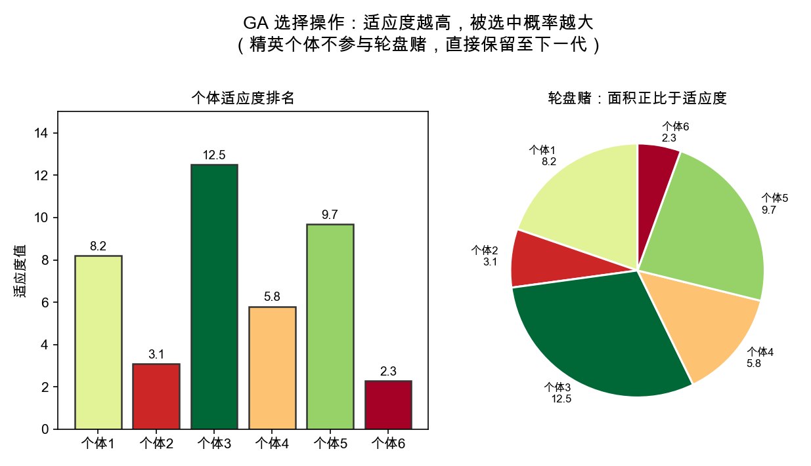

*图7.1：GA选择操作：左图为个体适应度柱状图，个体3最优；右图为轮盘赌——适应度越高的个体在轮盘上面积越大，但也有概率选中较差个体，维持种群多样性。*

### 7.1.5 Step 3：交叉——基因重组产生新个体

**单点交叉（二进制编码）：**随机选一个交叉点，交换两父代在交叉点前后的片段。例如父代A=`1010|1100`和父代B=`1100|1010`在位置4交叉，得到子代1=`1010|1010`和子代2=`1100|1100`。

**算术交叉（实数编码）：**子代是父代的凸组合：

$$
\text{子代}=\alpha\cdot\text{父代1}+(1-\alpha)\cdot\text{父代2},\quad \alpha\in[0,1].
$$

> 【可信度：经验建议】交叉概率取值是常用经验范围，具体设置需结合编码方式和实验结果调整。
>
> 交叉概率$P_c$通常取$0.7\sim0.9$，是GA产生新个体的主要驱动力。

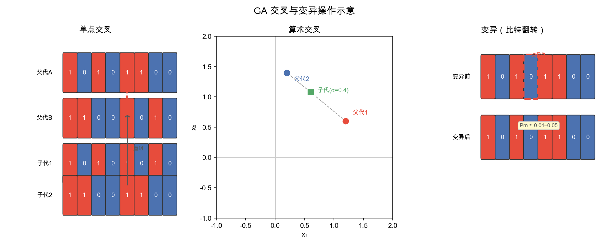

*图7.2：GA交叉与变异操作：左为单点交叉（二进制串在交叉点切断重组）、中为算术交叉（连续空间用向量凸组合）、右为变异（低概率随机翻转某位比特）。*

### 7.1.6 Step 4：变异——保持多样性的“防腐剂”

变异以很小的概率$P_m$随机翻转某个基因位（对二进制编码就是0变1或1变0）。$P_m$太低，种群早熟收敛，陷在局部最优出不来；$P_m$太高，退化为纯随机搜索，无法收敛。推荐$P_m=0.01\sim0.05$，或使用自适应变异（前期大，充分探索；后期小，精细收敛）。

### 7.1.7 种群进化可视化

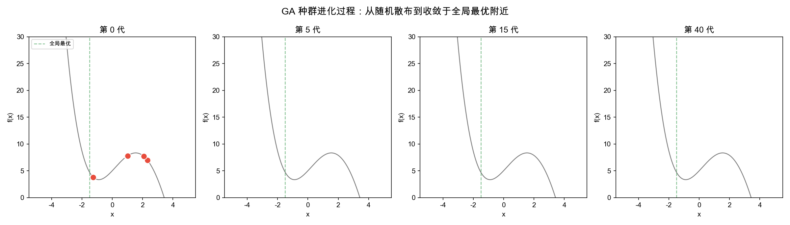

*图7.3：GA种群进化过程：从第0代个体随机散布在整个搜索区间→第5代开始向低值区域聚集→第15代更多个体靠近边界全局最优区域→第40代多数个体集中在较优区域。注意仍有少数个体分布在其他位置——这是变异维持的多样性。*

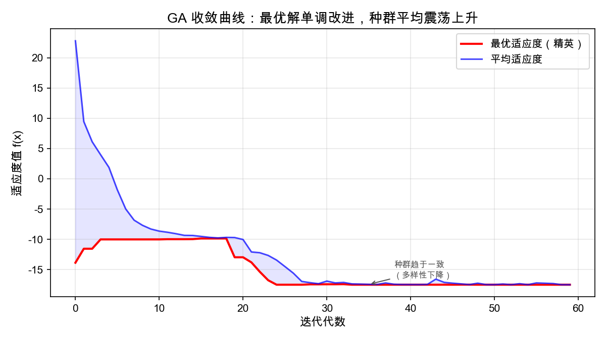

*图7.4：GA收敛曲线：最优适应度（红色）单调改善——精英保留保证最好的解不会丢失；平均适应度（蓝色）震荡上升——反映了选择、交叉、变异三种操作下种群整体质量的波动式提高。*

### 7.1.8 算法边界与选择决策

> **【性质】GA适用决策**
>
> 推荐使用：目标函数不可导、非凸、多峰，搜索空间大且不连续，需要较强的全局探索能力。
>
> 参数建议：种群规模50—200；交叉率0.7—0.9；变异率0.01—0.05；精英保留1—2个。
>
> 编码选择：连续变量→实数编码（精度高）；组合优化→排列编码；0-1决策→二进制编码。
>
> 核心优势：不依赖梯度信息，极其通用；种群并行搜索天然适合多峰函数。
>
> 核心弱点：收敛较慢，参数调优凭经验，无法给出最优性证明。

## 7.2 粒子群优化（PSO）

### 7.2.1 直观理解：鸟群如何找到食物

粒子群优化（Particle Swarm Optimization）由Kennedy和Eberhart于1995年提出，灵感来自鸟群觅食行为。想象一群鸟在森林中寻找食物——没有鸟知道食物在哪，但每只鸟知道：（1）自己飞过的最好位置（个体经验）；（2）整个鸟群目前发现的最好位置（社会信息）。每只鸟根据这两条信息调整飞行方向，整个鸟群逐步向食物聚集。

PSO相比GA最大的优势：极简、参数少、连续空间收敛快。不需要编码解码，不需要选择交叉变异——只需更新速度和位置两个向量，核心公式就一行。

### 7.2.2 一个例子入门

> 【可信度：示意例题】以下函数、粒子数和搜索结果用于演示 PSO 的群体搜索机制；具体表现需以代码复核。
>
> **【例题7.2】PSO：Rastrigin-like多峰函数**
>
> $$
> f(x_1,x_2)=x_1^2+x_2^2+8\left(2-\cos\frac{2\pi x_1}{3}-\cos\frac{2\pi x_2}{3}\right),\quad x_1,x_2\in[-5,5].
> $$
> 该函数在$(0,0)$处取得全局最优值$f\approx0$，但“地形”上遍布规律排列的局部最优坑洞（Rastrigin函数的特征）。用20个粒子在“多坑”地形上飞行，观察群体信息共享如何让粒子群越过局部坑洞汇聚于原点。

### 7.2.3 Step 1：速度更新——三力矢量合成

> **【定义7.2】PSO速度—位置更新**
>
> 粒子$i$在第$t+1$次迭代的更新规则：
> $$
> v_i^{t+1}=wv_i^t+c_1r_1(pbest_i-x_i^t)+c_2r_2(gbest-x_i^t),\tag{7.1}
> $$
> $$
> x_i^{t+1}=x_i^t+v_i^{t+1}.\tag{7.2}
> $$
> 其中$w$为惯性权重，$c_1$为个体认知系数，$c_2$为社会学习系数，$r_1,r_2\sim U(0,1)$为随机扰动。

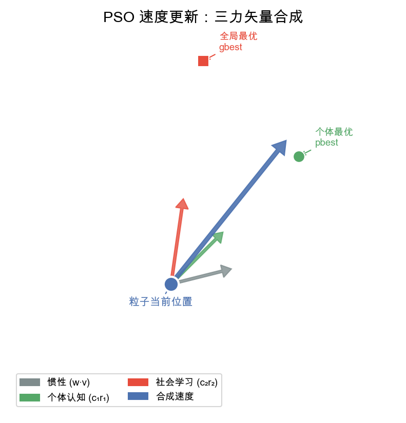

*图7.5：PSO速度更新：惯性（灰色）、个体认知（绿色）、社会学习（红色）三力矢量合成为粒子的最终飞行方向（蓝色）。注意粒子同时被自己经历过的最好位置和群体发现的最好位置“牵引”。*

三个力各自的含义：

1. 惯性项$wv_i^t$：粒子倾向于保持原飞行方向——$w$越大探索能力越强。
2. 个体认知项$c_1r_1(pbest_i-x_i^t)$：粒子被自己的历史最佳位置“拉回”。
3. 社会学习项$c_2r_2(gbest-x_i^t)$：粒子被群体目前发现的最佳位置“吸引”。

随机扰动$r_1,r_2$的作用：如果没有随机性，所有粒子会沿着完全确定的轨迹飞行，丧失多样性。$r_1,r_2$让个体认知和社会学习的力度在每步都不同，保持了搜索的随机探索能力。

### 7.2.4 Step 2：位置更新——粒子群飞行轨迹

每个粒子按合成速度更新位置，逐步飞向更优区域。所有粒子共享全局最优信息（gbest），信息的流动使得收敛速度通常快于GA。

### 7.2.5 Step 3：惯性权重调优——探索与开发的平衡

> 【可信度：经验建议】$w$从0.9到0.4是常见调参方案，不是普适最优设置，需通过实验复核。
>
> 推荐线性衰减策略：$w$从0.9逐渐减小到0.4。前期$w$大（0.9），粒子飞行“惯性大”，不易被$pbest/gbest$拉回，充分探索整个搜索空间；后期$w$小（0.4），粒子飞行“惯性小”，更多受$pbest/gbest$牵引，在已发现的好区域附近精细搜索。

这正是智能优化中探索（Exploration）与开发（Exploitation）平衡的经典实现。

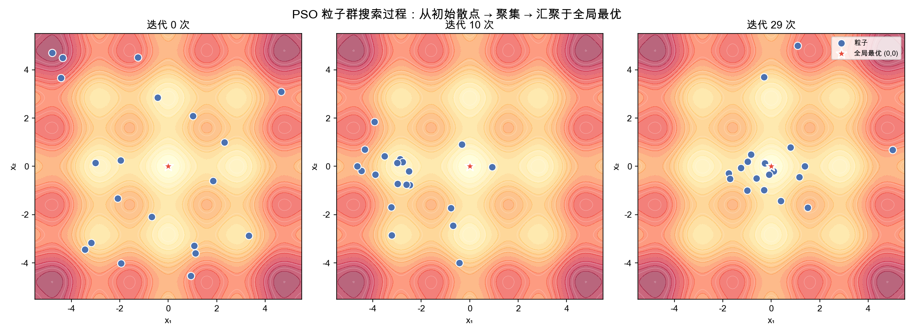

*图7.6：PSO粒子群搜索过程：背景等高线为目标函数的“地形”，蓝色散点为20个粒子的位置。从左到右依次是：初始随机散布→迭代10次后粒子向原点方向聚集→迭代29次后几乎全部汇聚于全局最优原点（红色星号）。注意部分粒子在途中曾被局部最优坑洞短暂“捕获”，但社会学习使它们最终逃脱。*

### 7.2.6 算法边界与选择决策

> **【性质】PSO适用决策**
>
> 推荐使用：连续变量优化、需要快速收敛——参数少、结构简单、代码仅十余行。
>
> 参数推荐：粒子数30—100；$w$从0.9线性衰减到0.4；$c_1=c_2=1.5\sim2.0$。
>
> PSO在连续空间更高效（无编码开销）；GA在离散、组合空间更有优势。
>
> 核心弱点：对离散问题不适用，容易早熟收敛（所有粒子太快挤在一起）。

## 7.3 模拟退火（SA）

### 7.3.1 直观理解：打铁淬火的数学

模拟退火（Simulated Annealing）由Kirkpatrick等人于1983年提出，灵感来自冶金学中的退火工艺：金属加热到高温→原子剧烈运动→缓慢冷却→原子逐渐排列成最低能量的晶体结构。如果冷却太快（淬火），原子来不及排列，得到的是高能量的非晶态——对应算法“困在局部最优”。

SA把目标函数值类比为系统“能量”，温度$T$控制搜索的“活跃程度”：高温阶段算法很“躁动”，即使找到更差的解也大概率接受，相当于原子剧烈运动，全面探索；低温阶段算法很“冷静”，基本只接受更优的解，相当于原子逐渐冻结在最优排列。

### 7.3.2 一个例子入门

> 【可信度：示意例题】以下函数、城市坐标和搜索设置用于演示模拟退火，不代表通用性能结论。
>
> **【例题7.3】SA：非凸函数+TSP两种场景**
>
> 1. 连续优化：$f(x)=0.08x^4-0.8x^3+0.5x^2+3x+5$（与GA同一函数），初始点$x=4$（靠近边界全局最优点）。
> 2. 组合优化：5城市TSP——城市坐标为$(1,1),(8,2),(10,8),(7,10),(3,7)$。
>
> 分别展示SA在连续和离散空间中的搜索行为。

### 7.3.3 Metropolis准则——接受劣解的数学机制

> 【可信度：公式定义】以下为 Metropolis 接受准则的标准定义；渐近最优性还需满足后文列出的附加条件。
>
> **【定义7.3】Metropolis准则**
>
> 设当前解能量为$E$，新解能量为$E'$，$\Delta E=E'-E$（最小化问题中，$\Delta E>0$表示新解更差）：
> $$
> P(\text{接受})=
> \begin{cases}
> 1,&\Delta E\leq0\quad(\text{新解更优，毫不犹豫接受})\\
> e^{-\Delta E/T},&\Delta E>0\quad(\text{新解更差，以概率接受})
> \end{cases}
> $$
>
> $T$为当前温度：$T$很大时$e^{-\Delta E/T}\approx1$，大量接受劣解，全面探索；$T$很小时$e^{-\Delta E/T}\approx0$，基本只接受更优解，精细收敛。

关键洞察：Metropolis准则使固定温度下的理想化马尔可夫链具有相应的平衡分布；在有限状态空间、邻域连通且降温满足足够慢的理论条件（典型为对数降温）时，SA才有以概率1趋于全局最优的渐近结论。工程中常用的指数降温、有限迭代和实际邻域通常不满足这些条件，因此只能把SA视为具有理论依据的随机启发式方法，不能据此保证一次运行得到全局最优。

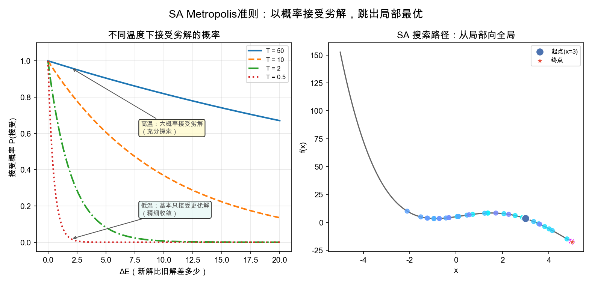

*图7.7：SA Metropolis准则：左图为不同温度下接受劣解的概率曲线——高温（$T=50$）下即使$\Delta E=20$仍有约67%接受概率，低温（$T=0.5$）下$\Delta E>3$就几乎不再接受。右图为SA在非凸函数上的搜索路径——颜色从蓝到红表示时间推进，注意搜索路径曾多次“翻越”山峰。*

### 7.3.4 降温方案——指数降温是常用折中

三种主流降温策略如下：
> - **指数降温（常用推荐）：**$T_{k+1}=\alpha T_k$，$\alpha\in[0.90,0.99]$。在常见的有限计算预算、参数经过调试且问题规模与邻域结构适配时，它通常是效率与搜索精度之间较常用的工程折中方案；具体参数仍需通过实验调整。
- **线性降温：**$T_{k+1}=T_0(1-k/K)$。全程均匀降温，简单但不精细。
- **对数降温：**$T_k=T_0/\ln(2+k)$。在满足有限状态空间、邻域连通等附加条件且降温足够慢时，具有渐近收敛理论；但降温极慢，工程上通常不实用。

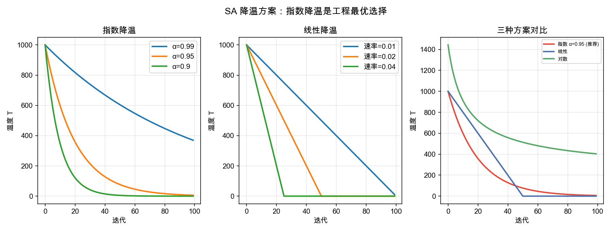

*图7.8：SA降温方案对比：左为指数降温（$\alpha$越小降温越快）、中为线性降温、右为三种方案在同一坐标系下的对比——指数降温便于在有限计算预算下平衡探索与开发，但具体效果取决于初温、降温系数、迭代次数和邻域结构，不能概括为工程上最优。*

### 7.3.5 SA vs贪心法的本质区别

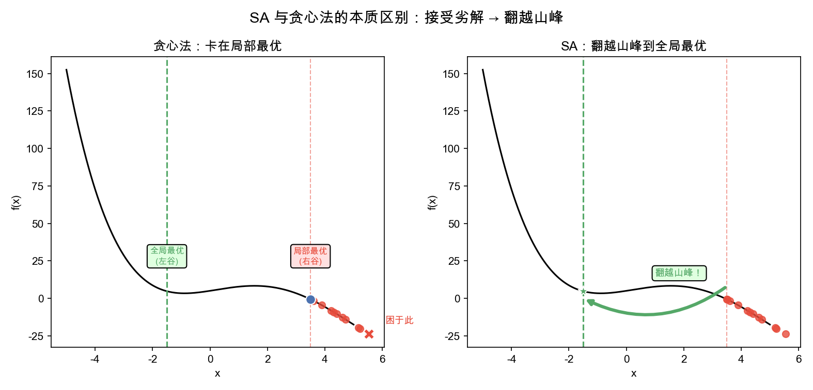

*图7.9：SA与贪心法的本质区别：左图贪心法从内部局部极小点附近出发，只接受更优，可能停留在局部极小点；右图SA通过Metropolis准则以一定概率接受劣解，能够探索更大的区域并发现边界处的更低目标值。*

贪心法（如梯度下降）永远只接受更优解，就像只允许“下山”——从内部局部极小点附近出发，走到局部谷底就可能停下。SA允许偶尔“上山”——越过当前区域后，可以探索更大的范围，发现边界处更低的目标值。

### 7.3.6 算法边界与选择决策

> **【性质】SA适用决策**
>
> 推荐使用：组合优化（TSP、调度、布局规划）；在满足状态空间、邻域和降温条件时可讨论渐近收敛理论，但工程参数下不保证一次运行得到全局最优。
>
> 参数调优：$T_0$应使初始接受率约80%。
>
> 不宜使用：大规模连续优化（PSO/GA更高效）、单次评估代价极高（SA需要大量迭代）。
>
> 邻域设计技巧：连续空间用高斯扰动；TSP用交换、逆序、插入等操作——邻域操作决定了搜索效率。

## 7.4 蚁群算法（ACO）

### 7.4.1 直观理解：蚂蚁如何找到最短路径

蚁群算法（Ant Colony Optimization）由Marco Dorigo于1992年提出，灵感来自真实蚂蚁的觅食行为。观察发现：蚂蚁在走过的路径上会留下信息素，后续蚂蚁倾向于选择信息素浓度更高的路径。

正反馈的魔力：假设从蚁巢到食物有两条路——一条短、一条长。最初蚂蚁随机选择。走短路的蚂蚁来回快，相同时间内短路上经过的蚂蚁更多，留下的信息素更浓→更多后续蚂蚁被吸引到短路→信息素继续积累→最终几乎所有蚂蚁都走最短路径。单个蚂蚁极弱（几乎随机行走），但通过信息素这一间接通信机制，整个蚁群涌现出高效的路径优化能力。

ACO常用于离散路径优化——TSP（旅行商问题）是其经典应用场景之一；其效果依赖信息素更新、蒸发率、启发式信息和邻域/候选边设计，不能概括为对所有路径问题都优于其他启发式方法。

### 7.4.2 一个例子入门

> **【例题7.4】ACO：6城市TSP**
>
> 6个城市均匀分布在圆周上，每只蚂蚁从随机城市出发，逐步构建完整回路。选择下一城市时蚂蚁综合考虑：（1）路径上的信息素浓度（集体经验的积累）；（2）距离倒数（贪婪启发，越近越诱人）。所有蚂蚁完成回路后，更新信息素——短路径获得更多沉积。

### 7.4.3 路径选择概率——信息素与启发信息的融合

> **【定义7.4】ACO选择概率**
>
> 蚂蚁$k$在城市$i$选择城市$j$作为下一站的概率：
> $$
> P_{ij}^{k}=\frac{[\tau_{ij}]^{\alpha}\cdot[\eta_{ij}]^{\beta}}{\sum_{l\in candidates}[\tau_{il}]^{\alpha}\cdot[\eta_{il}]^{\beta}}.
> $$
> 其中$\tau_{ij}$为边$(i,j)$上的信息素浓度（集体经验），$\eta_{ij}=1/d_{ij}$为启发信息（贪婪因子，距离越短越大），$\alpha$控制信息素的重要性，$\beta$控制启发信息的重要性。

参数$\alpha$和$\beta$的含义：$\alpha$大，蚂蚁更“从众”，紧跟信息素走，收敛快但易早熟；$\beta$大，蚂蚁更“贪婪”，永远选最近的，退化为贪心法。推荐$\alpha=1$，$\beta=2\sim5$——给贪婪启发稍高权重但保留信息素引导。

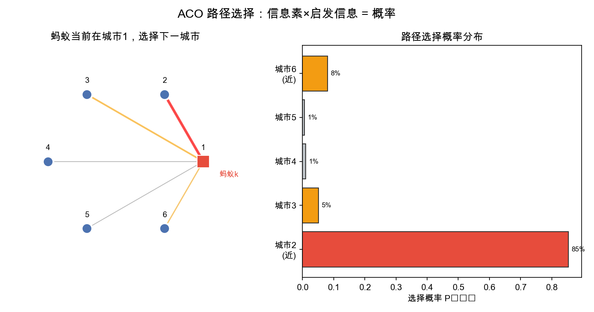

*图7.10：ACO路径选择：左图蚂蚁当前在城市1，连线粗细反映信息素和距离的综合权重——到城市2（近）和城市6（近）的边明显更“诱人”。右图为对应选择概率的柱状图——城市2因距离最近概率最高。*

### 7.4.4 信息素更新——蒸发与沉积的正反馈

> **【定义7.5】信息素更新**
>
> 每次迭代所有蚂蚁完成路径构建后：
>
> 1. 蒸发（全局）：$\tau_{ij}\leftarrow(1-\rho)\tau_{ij}$——所有边上的信息素以速率$\rho$衰减。
> 2. 沉积（局部）：$\tau_{ij}\leftarrow\tau_{ij}+\sum_k Q/L_k$——每只蚂蚁在自己走过的每条边上释放$Q/L_k$信息素。
>
> 其中$L_k$为蚂蚁$k$的路径总长，路径越短，沉积量越大，正反馈越强。

蒸发的关键作用：如果没有蒸发，最初随机选择的“运气好的劣路径”上的信息素也会慢慢累积，导致算法“记住错误的经验”。蒸发以速率$\rho$逐步清除旧信息素，使得只有被持续选中的好路径才能保持高信息素浓度。

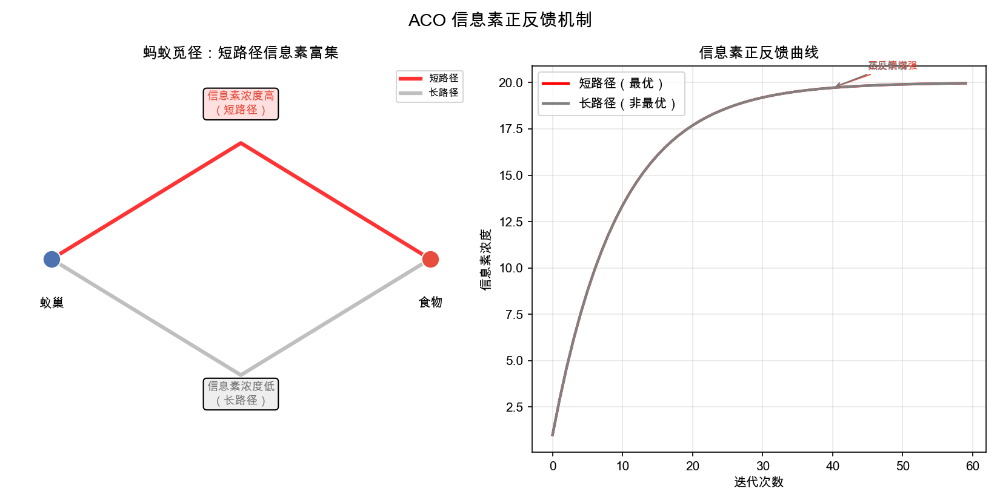

*图7.11：ACO信息素正反馈：左图为蚁巢到食物的两条路径——短路径（红）信息素浓度高，长路径（灰）浓度低；右图为信息素随时间变化——短路径信息素（红）通过正反馈单调上升，长路径（灰）被蒸发持续削弱。*

### 7.4.5 收敛与参数调优

$\rho$（蒸发率）是ACO最重要的参数，直接决定算法行为：

- $\rho$太小（如0.05）→信息素蒸发慢→收敛慢但解的质量好（有充分时间探索）。
- $\rho$太大（如0.7）→信息素蒸发快→收敛快但极易早熟（还没来得及探索就锁定一条路径）。

> 【可信度：经验建议】以下参数范围是常用调参起点，不是普适最优值，需结合实例实验调整。
>
> 推荐$\rho=0.1\sim0.5$，$\alpha=1$，$\beta=2\sim5$，蚂蚁数=城市数的1—2倍。

### 7.4.6 算法边界与选择决策

> **【性质】ACO适用决策**
>
> 推荐使用：离散路径优化——TSP、VRP（车辆路径问题）、网络路由、序列调度。
>
> 参数推荐：$\alpha=1$，$\beta=2\sim5$；$\rho=0.1\sim0.5$；蚂蚁数=问题规模1—2倍；$Q=100$。
>
> ACO与其他智能算法相比，信息素正反馈是ACO的独门绝技——路径类问题上效率远超通用GA/PSO/SA。
>
> 核心弱点：仅适用于可建模为“路径构建”的问题，不适用于连续优化。

## 7.5 常微分方程模型（ODE）

### 7.5.1 直观理解：变化率决定一切

常微分方程（ODE）是机理建模的核心工具，也是国赛A题的标准建模路线。核心思想极其朴素：许多系统的变化规律可表达为“变化率=$f$(当前状态)”这一简洁形式。一旦建立了这一关系，就能从初始状态出发，推演出系统未来的全部演化轨迹。

下面通过五个经典模型——牛顿冷却、Malthus人口增长、Logistic饱和增长、放射性衰变、SIR传染病——展示ODE建模的通用方法。

### 7.5.2 机理建模七步法

1. 问题分析——明确建模目的（预测、控制、理解）和系统边界。
2. 基本假设——抓住核心因素，忽略次要因素。例如“搅拌充分→温度处处均匀”使问题从PDE降为ODE。
3. 建立方程——从物理、生物或经济定律出发写出微分方程。
4. 定解条件——初始条件使问题封闭。
5. 数值求解——大多数实际ODE无解析解，用Euler/RK4法数值求解。
6. 参数辨识——用实验数据反推模型参数。
7. 独立验证——用未参与标定的数据检验模型预测能力。

### 7.5.3 模型一：牛顿冷却定律

> 【可信度：示意例题】以下咖啡温度、环境温度和观测值用于演示机理建模流程；计算结果需结合实测数据复核。
>
> **【例题7.5】咖啡冷却问题**
>
> 一杯90°C热咖啡置于25°C空调房间。已知3分钟后降至80°C。问：（1）咖啡降到60°C需多久？（2）30分钟后温度是多少？

**Step 1—2（物理定律→方程）：**牛顿冷却定律——温度变化率与环境温差成正比：

$$
\frac{dT}{dt}=-k(T-T_{env}),\qquad T(0)=90,\qquad T_{env}=25.
$$

负号表示温度高于环境时降温，低于环境时升温。$k>0$为冷却系数。

**Step 3（解析解）：**分离变量

$$
\frac{dT}{T-25}=-k\,dt,
$$

积分得

$$
T(t)=25+65e^{-kt}.
$$

这是指数衰减——从90°C起始，以指数方式趋近室温25°C。

**Step 6（参数标定）：**已知$T(3)=80$，代入得

$$
80=25+65e^{-3k},\qquad k=\frac{-\ln(55/65)}{3}\approx0.0557\ \mathrm{min}^{-1}.
$$

**Step 7（验证与预测）：**先保留原有的10分钟验证：

$$
T(10)=25+65e^{-0.0557\times10}\approx59.7\ ^\circ\mathrm{C}.
$$

若实测10分钟后温度为58°C，误差约1.7°C。

再计算题目要求的30分钟温度：

$$
T(30)=25+65e^{-0.0557\times30}\approx37.3\ ^\circ\mathrm{C}.
$$

因此，按该模型预测，30分钟后咖啡温度约为37.3°C。

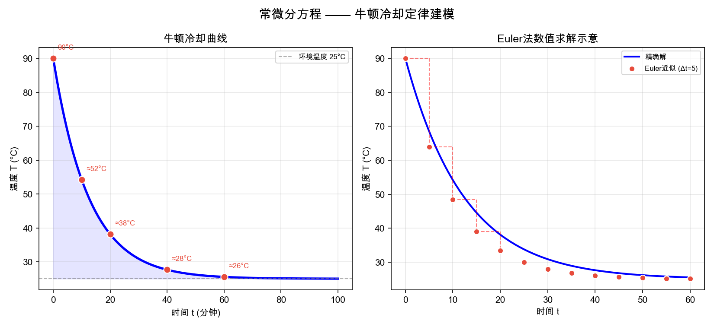

*图7.12：牛顿冷却曲线：左图为温度指数衰减，标注各时间点温度值；右图为Euler法（红点）与精确解（蓝线）的对比。*

### 7.5.4 模型二：Malthus人口指数增长

> 【可信度：示意例题】以下历史数据和模型表现用于演示指数增长模型的适用边界，预测效果需以实际数据复核。
>
> **【例题7.6】Malthus人口模型——美国1790—1880年人口预测**
>
> 1790年美国人口390万，1800年530万，1810年720万……起初增长看起来是指数型的。用Malthus模型拟合并验证其长期预测效果。

核心假设：人口增长率与当前人口成正比——人口越多，出生人数越多：

$$
\frac{dP}{dt}=rP,\qquad P(0)=P_0.
$$

其中$r$为净增长率（出生率−死亡率）。解析解为

$$
P(t)=P_0e^{rt}.
$$

$r>0$表示指数爆炸增长；$r<0$表示指数衰减归零。这个模型极其简洁，但在资源有限的世界里必然失效。

为什么Malthus模型会失灵？因为它假设资源无限、增长不受任何约束。现实中食物、空间、资源都有限——人口不可能永远指数增长。这正是引出Logistic模型的动机。

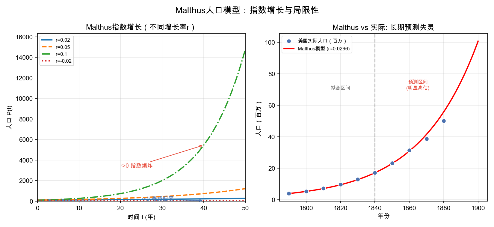

*图7.13：Malthus人口模型：左图为不同增长率下的指数增长、衰减曲线——$r>0$时曲线“爆炸”，$r<0$时衰减归零；右图为用1790—1840年数据拟合Malthus模型后预测1850—1880年——明显高估实际人口，暴露了指数模型的局限。*

### 7.5.5 模型三：Logistic人口饱和增长

> 【可信度：示意例题】以下人口参数和曲线阶段用于演示 Logistic 模型，实际参数需由数据标定。
>
> **【例题7.7】Logistic模型——有限资源下的人口增长**
>
> 在Malthus模型基础上引入环境容量$K$（环境能承载的最大人口）。初始人口$P_0=10$万，增长率$r=0.08$/年，环境容量$K=500$万。预测人口增长曲线。

核心改进：增长率不再是常数，而是随人口接近环境容量而递减：

$$
\frac{dP}{dt}=rP\left(1-\frac{P}{K}\right),\qquad P(0)=P_0.
$$

当$P\ll K$时，$(1-P/K)\approx1$，退化为Malthus指数增长；当$P\to K$时，$(1-P/K)\to0$，增长趋于停止。

解析解为著名的S型（Sigmoid）曲线：

$$
P(t)=\frac{K}{1+\left(\frac{K}{P_0}-1\right)e^{-rt}}.
$$

S型曲线的三个阶段：

1. 指数增长期：$P\ll K$，资源充裕，近似Malthus指数增长。
2. 减速增长期：$P$接近$K/2$，增长速率达到最大然后开始下降。
3. 饱和期：$P\to K$，增长近乎停滞，人口稳定在环境容量附近。

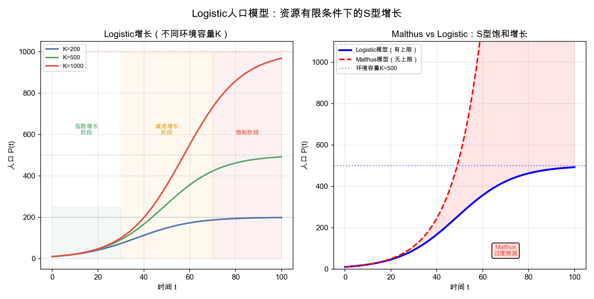

*图7.14：Logistic人口模型：左图为不同环境容量$K$下的S型增长曲线——$K$越大最终人口越多；右图为Malthus（红线）与Logistic（蓝线）的对比——Malthus无上限持续爆炸，Logistic在$K$处饱和，红色阴影区域表示Malthus过度预测的部分。*

### 7.5.6 模型四：SIR传染病传播模型

> 【可信度：示意例题】以下学校规模、传播率和康复率用于演示 SIR 模型，疫情预测需以实际监测数据和参数标定为准。
>
> **【例题7.8】SIR模型——某流感在学校传播**
>
> 某学校10000名学生，初始有1人感染流感。已知感染率$\beta=0.0003$（每人每天接触并感染的人数比例），康复率$\gamma=0.1$（感染者每天康复的概率为10%，即平均病程10天）。预测疫情发展，估算最终感染人数。

模型结构：SIR 模型将总人口划分为三个随时间变化的状态变量：

- $S(t)$——易感者（Susceptible）：尚未感染但可能被传染。
- $I(t)$——感染者（Infectious）：已感染且具有传染性。
- $R(t)$——康复者（Recovered）：已康复并获得免疫，或已死亡且不再参与传播。

这里 $S(t),I(t),R(t)$ 分别表示时刻 $t$ 的易感者、感染者和移出传播者人数；$\beta$ 是按人数计量的有效传播率，表示单位时间内易感者与感染者接触并导致传播的比例系数；$\beta SI$ 是新增感染流量；$\beta$ 的单位为 $(\text{人数}\cdot\text{天})^{-1}$。$\gamma$ 是康复或移出率，表示感染者单位时间离开感染状态的比例，单位为 $\text{天}^{-1}$；$\gamma I$ 是移出流量。

动力学方程（三个ODE耦合）：

$$
\frac{dS}{dt}=-\beta SI,
$$
$$
\frac{dI}{dt}=\beta SI-\gamma I,
$$
$$
\frac{dR}{dt}=\gamma I.
$$
其中$S(t),I(t),R(t)$均表示人数，$N=S+I+R$为总人数，时间$t$以天计。因此$\beta$的量纲为$(\text{人数}\cdot\text{天})^{-1}$，使得$\beta SI$的量纲为“人/天”；$\gamma$的量纲为$\text{天}^{-1}$，使得$\gamma I$也为“人/天”。若改用人数比例$s=S/N,i=I/N,r=R/N$，则方程写为$ds/dt=-\beta Nsi$、$di/dt=\beta Nsi-\gamma i$、$dr/dt=\gamma i$，此时常将$\beta N$重新记作单位为$\text{天}^{-1}$的有效接触率。

方程含义：

- $dS/dt=-\beta SI$：易感者减少速率=易感者人数×感染者人数。$S$和$I$越大，接触越多，感染越快。
- $dI/dt=\beta SI-\gamma I$：感染者变化=新增感染（$\beta SI$）−康复（$\gamma I$）。当$\beta SI<\gamma I$时，感染人数开始下降。
- $dR/dt=\gamma I$：康复者增加速率=感染者人数×康复率。

$$
R_0=\frac{\beta S(0)}{\gamma}.
$$

$R_0$表示在初始近似全易感人群中，一个感染者平均造成的二代感染数。$R_0>1$表示初期感染者数量会增长，$R_0<1$表示初期会下降；这是初期趋势判断，不等于对整个疫情过程的直接保证。本例中

$$
R_0=\frac{0.0003}{0.1}\times9999\approx30,
$$

传染性极高。

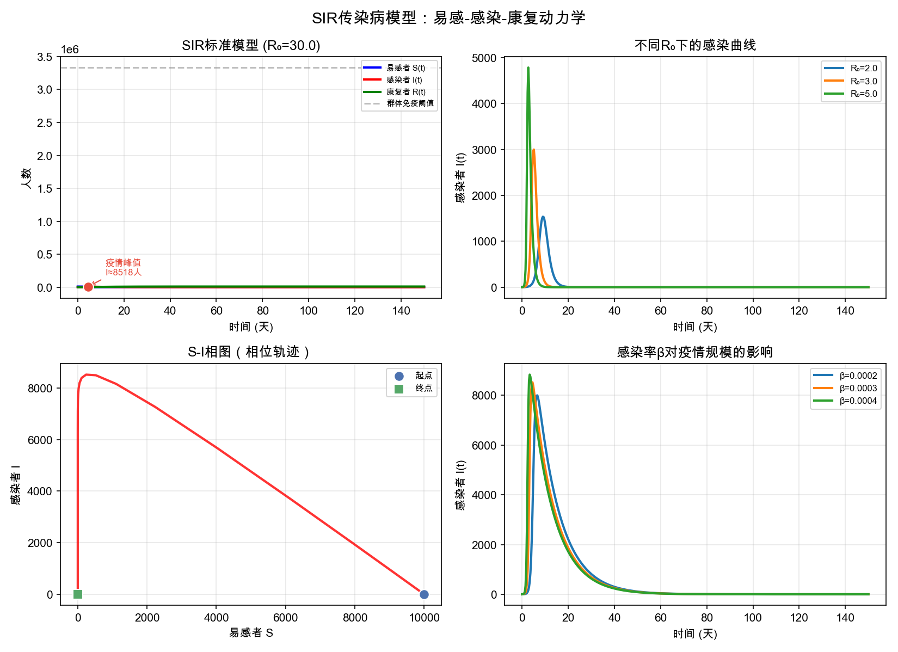

*图7.15：SIR传染病模型：左上为标准SIR三曲线——易感者$S(t)$（蓝）单调下降，感染者$I(t)$（红）先升后降形成疫情高峰，康复者$R(t)$（绿）单调上升趋于总人数；右上为不同$R_0$值下的感染曲线——$R_0$越大峰值越高、来得越早；左下为$S-I$相图，展示系统在相空间中的演化轨迹；右下为感染率$\beta$对疫情规模的影响。*

从SIR模型可以回答的实际问题：

- 疫情何时达峰？在$S(t)=\gamma/\beta$时——即易感者减少到一定程度后，感染开始下降。
- 最终多少人感染？在封闭、均匀混合且参数恒定的标准 SIR 假设下，令 $S_\infty=S(\infty)$，可由
  $$
  S_\infty=S(0)\exp\left[-\frac{\beta}{\gamma}\bigl(N-S_\infty\bigr)\right]
  $$
  求解；若初始易感者约等于 $N$，才可近似写成 $S_\infty\approx S(0)e^{-R_0(1-S_\infty/N)}$。该结果表示仍可能有未感染者，不等于对现实疫情的直接预测。
- 如何控制疫情？降低$\beta$（戴口罩、隔离）或增大$\gamma$（加快治疗）通常会降低初期 $R_0$，并可能压低峰值、推迟达峰时间；具体效果需结合干预时变性和重新传播等因素模拟。

### 7.5.7 Euler数值解法

大多数实际ODE没有解析解（如SIR模型），需要数值方法。Euler法是最简单直观的：

$$
y_{n+1}=y_n+h\cdot f(t_n,y_n).
$$

每一步用当前斜率$f(t_n,y_n)$做线性外推，步长$h$越小，精度越高，但计算量越大。

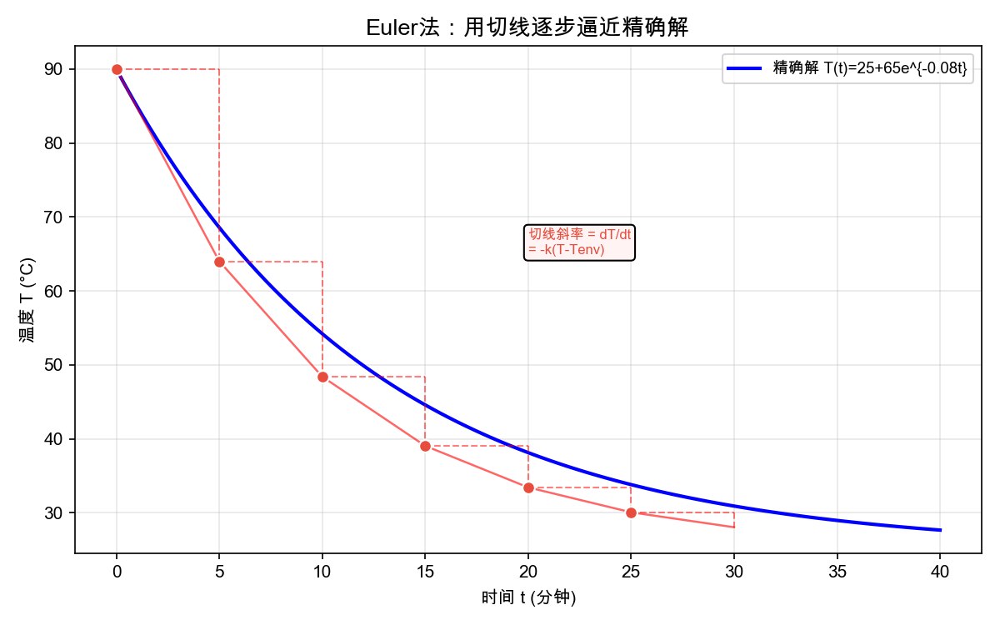

*图7.16：Euler法精度与步长的关系：从左到右步长分别为$\Delta t=10,5,1$。步长越小，折线越接近蓝色精确曲线，精度越高。红色虚线为每步的切线方向，展示Euler法“沿切线一步一步走”的直观原理。*

### 7.5.8 算法边界与选择决策

> **【性质】机理建模适用决策**
>
> 推荐使用：物理、化学、生物、工程等有明确定律的系统；数据稀少但物理规律已知的场景。
>
> 假设是灵魂：假设决定模型精度——太少无法求解，太多偏离现实。关键假设必须明确列出并讨论其合理性（赛论文加分项）。
>
> 数值方法选择：非刚性ODE→经典RK4；刚性ODE（多时间尺度共存）→隐式方法；高精度→变步长RK45。
>
> 从简单到复杂：Malthus（1参数）→Logistic（2参数）→SIR（多参数耦合）——建模应从简单出发，逐步放松假设。

## 7.6 算法对比与选择决策

学完四种智能优化算法和一种机理建模方法，你可能会问：到底该选哪个？答案取决于你的问题特征。下面的表格帮助你快速决策。

### 表7.1 四种智能优化算法横向对比

| 算法 | 灵感来源 | 搜索方式 | 核心机制 | 最佳场景 |
|---|---|---|---|---|
| GA | 自然进化 | 种群并行 | 选择×交叉×变异 | 通用全局优化、离散/组合 |
| PSO | 鸟群觅食 | 群体飞行 | 个体+社会学习 | 连续优化、快速收敛 |
| SA | 金属退火 | 单点随机游走 | Metropolis概率接受劣解 | 组合优化、具有渐近理论依据 |
| ACO | 蚂蚁寻径 | 群体+信息素 | 正反馈+蒸发 | TSP、VRP等离散路径 |

## 7.7 本章总结

### 结论

- 智能优化核心哲学：不求数学最优性证明，以随机搜索+启发式引导在可接受时间内找到足够好的解——这是与第6章经典优化最本质的区别。
- GA三大算子——选择（轮盘赌+精英保留，适者生存）、交叉（单点/算术，基因重组）、变异（低概率随机扰动，维持多样性）——三者协同实现种群逐代进化。
- PSO极简之美——仅用惯性+个体认知+社会学习三项驱动力控制粒子群运动，$w$从0.9线性衰减到0.4，平衡探索与开发，参数比GA少一半但连续空间效率更高。
- SA的Metropolis准则——以$e^{-\Delta E/T}$的概率接受劣解；在有限状态空间、邻域连通和足够慢降温等条件下可得到渐近收敛结论，但工程参数下不保证一次运行得到全局最优。
- ACO信息素正反馈——短路径通过正反馈富集信息素，蒸发机制防止早熟，是离散路径优化领域的专用利器。
- 机理建模七步法（问题分析→基本假设→建立方程→定解条件→数值求解→参数辨识→独立验证）是国赛A题标配路线，假设驱动建模，数据驱动验证。
- 探索与开发的平衡是智能优化的永恒主题——探索过强收敛慢，开发过强易早熟。每种算法都有自己的平衡方式：GA靠变异率、PSO靠惯性权重、SA靠温度、ACO靠蒸发率。

## 第7章练习

1. 对
   $$
   f(x_1,x_2)=x_1^2+x_2^2+3\sin x_1+3\sin x_2,\quad (x_1,x_2\in[-5,5])
   $$
   分别用GA和PSO求解全局最小值。从收敛速度、解的精度、参数数量三个角度对比，讨论哪个更适合此问题并说明理由。
2. 用SA求解6城市TSP（城市坐标随机生成）。设计三种不同的邻域操作（交换两城市、逆序一段序列、插入一个城市），比较它们对收敛速度和解质量的影响，分析哪种邻域操作最优。
3. GA的种群规模从20逐步增加到200，观察最优解质量和收敛代数（所需迭代次数）的变化。从计算成本和解质量两个维度解释为什么种群并非越大越好，给出合理的推荐范围。
4. PSO的惯性权重$w$分别使用“0.9→0.4线性衰减”和“固定$w=0.7$”两种策略，在Rastrigin函数上对比效果。从探索与开发平衡的角度解释哪种策略更好，并用实验结果佐证。
5. ACO的蒸发率$\rho$分别取0.05、0.3、0.8——在同一个TSP实例上运行，绘制三种情况下的信息素浓度变化曲线和最优路径长度变化曲线。分析$\rho$如何影响正反馈的强度和收敛行为。
6. 热水瓶机理建模实战：初始95°C，室温25°C，3小时后测得60°C。
   1. 建立牛顿冷却ODE模型并推导解析解。
   2. 用3小时数据标定冷却系数$k$。
   3. 预测6小时和12小时后水温。
   4. 用Euler法（$\Delta t=30$分钟）数值求解并对比解析解，分析误差来源。
7. AI辅助建模实验：让AI完成上述热水瓶问题的全部数学推导和计算。写出完整的中文Prompt（包含角色设定、问题数据、输出格式要求、验证要求），运行AI生成的代码，分析输出中至少两个可能需要人工修正的地方，讨论AI辅助建模的优势与潜在风险。
